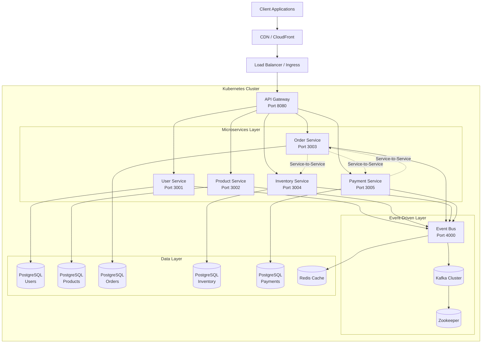
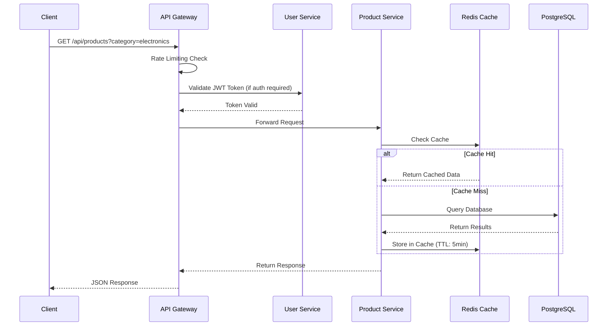
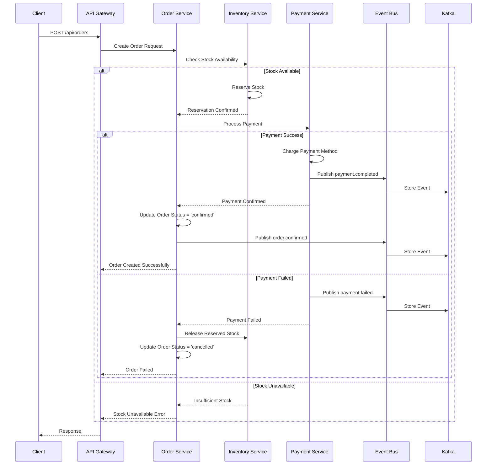
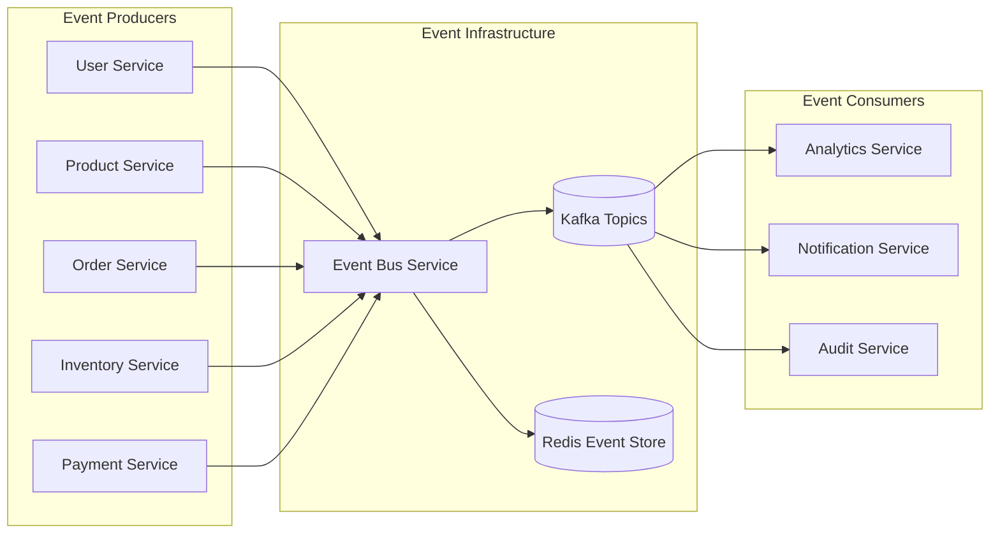
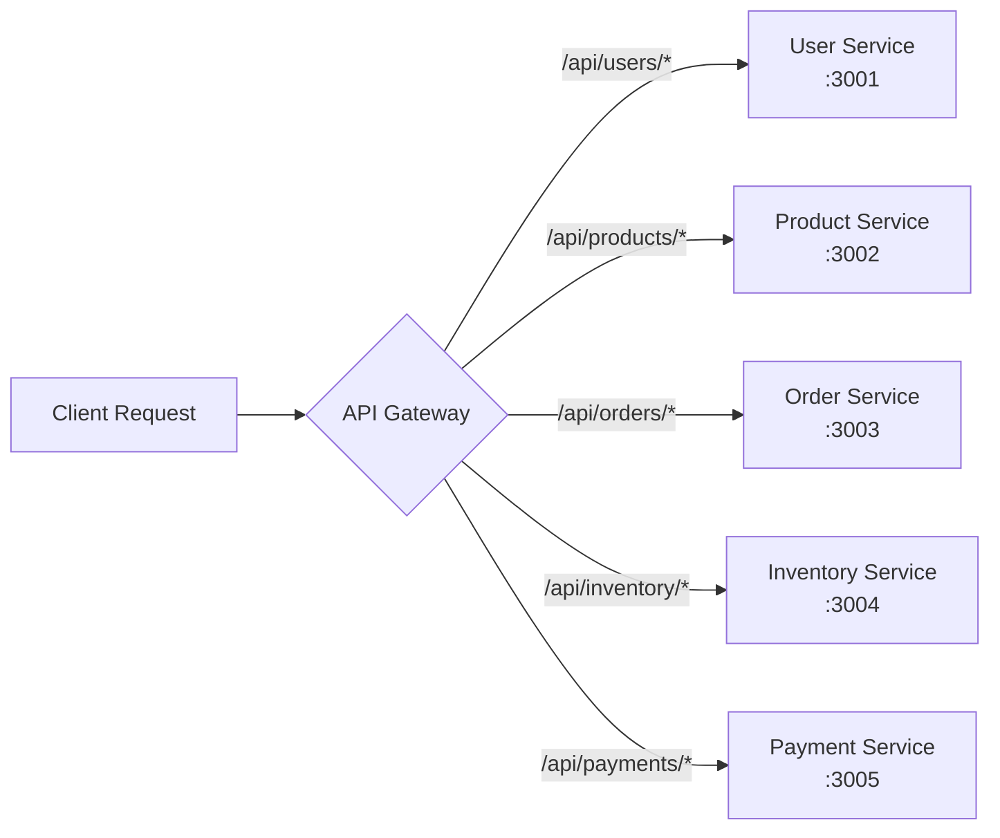
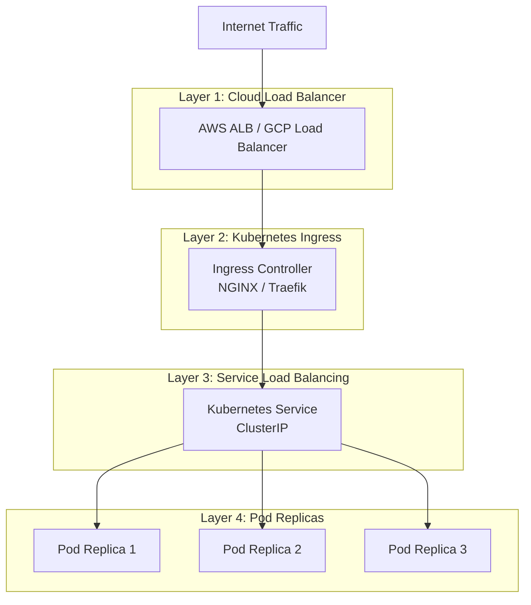

# CloudRetail Platform Architecture

## Table of Contents
- [Overview](#overview)
- [System Architecture](#system-architecture)
- [Cloud-Native Design Principles](#cloud-native-design-principles)
- [Technology Stack](#technology-stack)
- [Microservices Architecture](#microservices-architecture)
- [Data Flow](#data-flow)
- [Event-Driven Architecture](#event-driven-architecture)
- [Database Schema Design](#database-schema-design)
- [API Gateway Routing](#api-gateway-routing)
- [Service Discovery and Health Checking](#service-discovery-and-health-checking)
- [Load Balancing Strategy](#load-balancing-strategy)

---

## Overview

CloudRetail is a cloud-native, microservices-based e-commerce platform designed for high availability, scalability, and fault tolerance. The platform follows modern architectural patterns and best practices to deliver a robust, production-ready solution.

### Key Features
- **Microservices Architecture**: Independent, loosely-coupled services
- **Event-Driven Communication**: Asynchronous messaging using Kafka
- **API Gateway Pattern**: Single entry point for all client requests
- **Database Per Service**: Each service owns its data
- **Container Orchestration**: Kubernetes for deployment and scaling
- **Cloud-Native**: Designed for cloud environments with 12-factor app principles

---

## System Architecture



### Architecture Components

1. **Client Layer**: Web, mobile, and third-party applications
2. **CDN Layer**: Content delivery and static asset caching
3. **Load Balancer**: Kubernetes Ingress for traffic distribution
4. **API Gateway**: Single entry point, routing, authentication, rate limiting
5. **Microservices**: Business logic and domain services
6. **Event Bus**: Event publishing and subscription management
7. **Message Broker**: Kafka for reliable event streaming
8. **Data Layer**: PostgreSQL databases and Redis cache

---

## Cloud-Native Design Principles

CloudRetail follows the [12-Factor App](https://12factor.net/) methodology:

### 1. Codebase
- Single codebase tracked in Git
- Monorepo structure with independent service deployments
- Shared libraries via npm workspaces

### 2. Dependencies
- Explicitly declared in package.json
- Isolated per service with Docker containers
- No implicit system dependencies

### 3. Config
- Environment-based configuration
- Secrets managed via Kubernetes Secrets
- ConfigMaps for non-sensitive configuration

### 4. Backing Services
- Databases, caches, and message queues as attached resources
- Connection URLs in environment variables
- Easy to swap implementations

### 5. Build, Release, Run
- Strict separation of build and run stages
- Docker multi-stage builds
- Immutable container images

### 6. Processes
- Stateless application processes
- Shared state in backing services (databases, caches)
- Horizontally scalable

### 7. Port Binding
- Self-contained services exposing HTTP endpoints
- Each service binds to its own port
- No external web server required

### 8. Concurrency
- Scale out via process model
- Kubernetes HPA for automatic scaling
- Multiple replicas per service

### 9. Disposability
- Fast startup and graceful shutdown
- SIGTERM handling for clean shutdowns
- Health checks for readiness and liveness

### 10. Dev/Prod Parity
- Keep development, staging, and production similar
- Docker Compose for local development
- Kubernetes for all environments

### 11. Logs
- Treat logs as event streams
- Stdout/stderr logging
- Centralized log aggregation

### 12. Admin Processes
- One-off admin tasks as separate processes
- Database migrations
- Maintenance scripts

---

## Technology Stack

### Backend Services
- **Runtime**: Node.js 20.x LTS
- **Language**: TypeScript 5.x
- **Framework**: Express.js
- **ORM**: Sequelize

### Databases
- **Primary Database**: PostgreSQL 15
- **Caching Layer**: Redis 7
- **Message Broker**: Apache Kafka 7.5

### API Gateway
- **Framework**: Express.js
- **Proxy**: http-proxy-middleware
- **Security**: Helmet, CORS, Rate Limiting

### Container & Orchestration
- **Containerization**: Docker
- **Orchestration**: Kubernetes
- **Service Mesh**: Network Policies (zero-trust)

### Development Tools
- **Testing**: Jest
- **Monitoring**: Prometheus, Grafana
- **CI/CD**: GitHub Actions, Jenkins
- **Load Testing**: Artillery, k6

### Security
- **Authentication**: JWT (JSON Web Tokens)
- **Authorization**: RBAC (Role-Based Access Control)
- **Encryption**: TLS 1.3, AES-256
- **Secrets**: Kubernetes Secrets, HashiCorp Vault

---

## Microservices Architecture

### Service Inventory

#### 1. User Service (Port 3001)
**Responsibilities:**
- User registration and authentication
- User profile management
- Role-based access control (customer, admin, vendor)
- Two-factor authentication
- GDPR consent tracking

**Database**: cloudretail_users (PostgreSQL)

**Events Published:**
- `user.created`
- `user.updated`
- `user.deleted`
- `user.login`

#### 2. Product Service (Port 3002)
**Responsibilities:**
- Product catalog management
- Product search and filtering
- Category management
- Pricing management
- Product availability

**Database**: cloudretail_products (PostgreSQL)

**Events Published:**
- `product.created`
- `product.updated`
- `product.deleted`
- `product.price_changed`

#### 3. Order Service (Port 3003)
**Responsibilities:**
- Order creation and management
- Order status tracking
- Order history
- Order validation
- Integration with inventory and payment

**Database**: cloudretail_orders (PostgreSQL)

**Events Published:**
- `order.created`
- `order.confirmed`
- `order.cancelled`
- `order.shipped`
- `order.delivered`

**Events Consumed:**
- `payment.completed`
- `inventory.reserved`

#### 4. Inventory Service (Port 3004)
**Responsibilities:**
- Stock level management
- Inventory reservation
- Stock replenishment
- Low stock alerts
- Warehouse management

**Database**: cloudretail_inventory (PostgreSQL)

**Events Published:**
- `inventory.updated`
- `inventory.reserved`
- `inventory.released`
- `inventory.low_stock`

**Events Consumed:**
- `order.created`
- `order.cancelled`

#### 5. Payment Service (Port 3005)
**Responsibilities:**
- Payment processing
- Payment gateway integration
- Refund management
- Payment history
- PCI DSS compliance

**Database**: cloudretail_payments (PostgreSQL)

**Events Published:**
- `payment.initiated`
- `payment.completed`
- `payment.failed`
- `payment.refunded`

**Events Consumed:**
- `order.created`

---

## Data Flow

### Request Flow Diagram



### Order Processing Flow



---

## Event-Driven Architecture

CloudRetail uses an event-driven architecture for asynchronous communication between services, enabling loose coupling and high scalability.

### Event Architecture Diagram



### Event Structure

```typescript
interface Event {
  id: string;                    // Unique event ID (UUID)
  type: string;                  // Event type (e.g., "order.created")
  timestamp: Date;               // Event timestamp
  version: string;               // Event schema version
  data: any;                     // Event payload
  metadata: {
    correlationId: string;       // Request correlation ID
    causationId?: string;        // Causing event ID
    service: string;             // Source service
    userId?: string;             // User who triggered event
  };
}
```

### Kafka Topics

| Topic | Purpose | Partitions | Retention |
|-------|---------|------------|-----------|
| `user-events` | User lifecycle events | 3 | 7 days |
| `product-events` | Product catalog events | 3 | 7 days |
| `order-events` | Order processing events | 6 | 30 days |
| `inventory-events` | Stock management events | 3 | 30 days |
| `payment-events` | Payment transactions | 6 | 90 days |

### Event Patterns

#### 1. Event Notification
- Services publish events when state changes
- Consumers react to events asynchronously
- Example: Order created → Send confirmation email

#### 2. Event-Carried State Transfer
- Events carry complete state information
- Consumers maintain local cache
- Example: Product updated → Update search index

#### 3. Event Sourcing
- Events as source of truth
- State rebuilt from event log
- Example: Order status from sequence of events

---

## Database Schema Design

### Database Per Service Pattern

Each microservice has its own dedicated database, ensuring:
- **Autonomy**: Services can evolve independently
- **Isolation**: Failures don't cascade across databases
- **Scalability**: Databases can be scaled independently
- **Technology Choice**: Each service can use optimal database

### Schema Overview

#### User Service Database

```sql
-- Users Table
CREATE TABLE users (
    id UUID PRIMARY KEY DEFAULT gen_random_uuid(),
    email VARCHAR(255) UNIQUE NOT NULL,
    password VARCHAR(255) NOT NULL,
    first_name VARCHAR(100) NOT NULL,
    last_name VARCHAR(100) NOT NULL,
    role VARCHAR(20) CHECK (role IN ('customer', 'admin', 'vendor')),
    is_active BOOLEAN DEFAULT true,
    gdpr_consent BOOLEAN DEFAULT false NOT NULL,
    two_factor_enabled BOOLEAN DEFAULT false,
    two_factor_secret VARCHAR(255),
    created_at TIMESTAMP DEFAULT NOW(),
    updated_at TIMESTAMP DEFAULT NOW()
);

CREATE INDEX idx_users_email ON users(email);
CREATE INDEX idx_users_role ON users(role);
CREATE INDEX idx_users_active ON users(is_active);
```

#### Product Service Database

```sql
-- Products Table
CREATE TABLE products (
    id UUID PRIMARY KEY DEFAULT gen_random_uuid(),
    name VARCHAR(255) NOT NULL,
    description TEXT,
    price DECIMAL(10, 2) NOT NULL CHECK (price >= 0),
    category VARCHAR(100),
    sku VARCHAR(100) UNIQUE NOT NULL,
    image_url VARCHAR(500),
    is_active BOOLEAN DEFAULT true,
    created_at TIMESTAMP DEFAULT NOW(),
    updated_at TIMESTAMP DEFAULT NOW()
);

CREATE INDEX idx_products_category ON products(category);
CREATE INDEX idx_products_sku ON products(sku);
CREATE INDEX idx_products_active ON products(is_active);
CREATE INDEX idx_products_price ON products(price);
```

#### Order Service Database

```sql
-- Orders Table
CREATE TABLE orders (
    id UUID PRIMARY KEY DEFAULT gen_random_uuid(),
    user_id UUID NOT NULL,
    items JSONB NOT NULL,
    total_amount DECIMAL(10, 2) NOT NULL CHECK (total_amount >= 0),
    status VARCHAR(20) CHECK (status IN ('pending', 'confirmed', 'processing', 'shipped', 'delivered', 'cancelled')),
    shipping_address JSONB NOT NULL,
    payment_id UUID,
    created_at TIMESTAMP DEFAULT NOW(),
    updated_at TIMESTAMP DEFAULT NOW()
);

CREATE INDEX idx_orders_user_id ON orders(user_id);
CREATE INDEX idx_orders_status ON orders(status);
CREATE INDEX idx_orders_payment_id ON orders(payment_id);
CREATE INDEX idx_orders_created_at ON orders(created_at);
```

#### Inventory Service Database

```sql
-- Inventory Table
CREATE TABLE inventory (
    id UUID PRIMARY KEY DEFAULT gen_random_uuid(),
    product_id UUID NOT NULL UNIQUE,
    quantity INTEGER NOT NULL CHECK (quantity >= 0),
    reserved INTEGER DEFAULT 0 CHECK (reserved >= 0),
    warehouse_location VARCHAR(100),
    reorder_level INTEGER DEFAULT 10,
    reorder_quantity INTEGER DEFAULT 100,
    created_at TIMESTAMP DEFAULT NOW(),
    updated_at TIMESTAMP DEFAULT NOW()
);

CREATE INDEX idx_inventory_product_id ON inventory(product_id);
CREATE INDEX idx_inventory_quantity ON inventory(quantity);
```

#### Payment Service Database

```sql
-- Payments Table
CREATE TABLE payments (
    id UUID PRIMARY KEY DEFAULT gen_random_uuid(),
    order_id UUID NOT NULL,
    user_id UUID NOT NULL,
    amount DECIMAL(10, 2) NOT NULL CHECK (amount >= 0),
    currency VARCHAR(3) DEFAULT 'USD',
    status VARCHAR(20) CHECK (status IN ('pending', 'processing', 'completed', 'failed', 'refunded')),
    payment_method VARCHAR(50),
    transaction_id VARCHAR(255),
    gateway VARCHAR(50),
    created_at TIMESTAMP DEFAULT NOW(),
    updated_at TIMESTAMP DEFAULT NOW()
);

CREATE INDEX idx_payments_order_id ON payments(order_id);
CREATE INDEX idx_payments_user_id ON payments(user_id);
CREATE INDEX idx_payments_status ON payments(status);
CREATE INDEX idx_payments_transaction_id ON payments(transaction_id);
```

---

## API Gateway Routing

### Routing Configuration



### API Gateway Responsibilities

1. **Request Routing**: Direct requests to appropriate microservices
2. **Authentication**: JWT token validation
3. **Authorization**: Role-based access control
4. **Rate Limiting**: Prevent abuse and DDoS attacks
5. **CORS**: Cross-origin resource sharing
6. **Security Headers**: Helmet middleware for HTTP security
7. **Request/Response Logging**: Centralized logging
8. **Error Handling**: Standardized error responses
9. **Circuit Breaking**: Fail fast on service unavailability
10. **Load Balancing**: Distribute load across service replicas

### Endpoint Mapping

| Client Endpoint | Target Service | Port | Authentication |
|----------------|----------------|------|----------------|
| `POST /api/users/register` | User Service | 3001 | No |
| `POST /api/users/login` | User Service | 3001 | No |
| `GET /api/users/profile` | User Service | 3001 | Yes |
| `GET /api/products` | Product Service | 3002 | No |
| `POST /api/products` | Product Service | 3002 | Yes (Admin) |
| `POST /api/orders` | Order Service | 3003 | Yes |
| `GET /api/orders/:id` | Order Service | 3003 | Yes |
| `GET /api/inventory/:productId` | Inventory Service | 3004 | No |
| `PUT /api/inventory/:productId` | Inventory Service | 3004 | Yes (Admin) |
| `POST /api/payments` | Payment Service | 3005 | Yes |

---

## Service Discovery and Health Checking

### Service Registry

The API Gateway maintains a service registry for dynamic service discovery:

```typescript
class ServiceRegistry {
  private services: Map<string, ServiceConfig>;

  registerService(name: string, config: ServiceConfig): void;
  getServiceUrl(name: string): string;
  healthCheck(name: string): Promise<boolean>;
  startHealthChecks(): void;
  stopHealthChecks(): void;
}
```

### Health Check Implementation

Each service exposes health check endpoints:

#### 1. Liveness Probe
- **Endpoint**: `GET /health/live`
- **Purpose**: Check if service is running
- **Response**: 200 OK if alive, 503 if not

#### 2. Readiness Probe
- **Endpoint**: `GET /health/ready`
- **Purpose**: Check if service is ready to accept traffic
- **Checks**: Database connectivity, event bus connection
- **Response**: 200 OK if ready, 503 if not

### Kubernetes Health Checks

```yaml
livenessProbe:
  httpGet:
    path: /health/live
    port: 3001
  initialDelaySeconds: 30
  periodSeconds: 10
  timeoutSeconds: 5
  failureThreshold: 3

readinessProbe:
  httpGet:
    path: /health/ready
    port: 3001
  initialDelaySeconds: 10
  periodSeconds: 5
  timeoutSeconds: 3
  failureThreshold: 3
```

### Health Status Response

```json
{
  "status": "healthy",
  "timestamp": "2026-02-01T12:00:00Z",
  "uptime": 3600,
  "details": {
    "database": true,
    "cache": true,
    "eventBus": true
  }
}
```

---

## Load Balancing Strategy

### Multi-Layer Load Balancing



### Load Balancing Algorithms

#### 1. Layer 7 (Application Layer)
- **Algorithm**: Round Robin with Health Checks
- **Implementation**: Kubernetes Service
- **Features**:
  - Session affinity (optional)
  - Health-based routing
  - Automatic pod registration/deregistration

#### 2. API Gateway Load Balancing
- **Algorithm**: Least Connection
- **Features**:
  - Circuit breaking
  - Retry logic
  - Timeout management

### Horizontal Pod Autoscaling

```yaml
apiVersion: autoscaling/v2
kind: HorizontalPodAutoscaler
metadata:
  name: api-gateway-hpa
spec:
  scaleTargetRef:
    apiVersion: apps/v1
    kind: Deployment
    name: api-gateway
  minReplicas: 3
  maxReplicas: 20
  metrics:
  - type: Resource
    resource:
      name: cpu
      target:
        type: Utilization
        averageUtilization: 70
  - type: Resource
    resource:
      name: memory
      target:
        type: Utilization
        averageUtilization: 80
```

### Scaling Policies

| Service | Min Replicas | Max Replicas | CPU Target | Memory Target |
|---------|-------------|--------------|------------|---------------|
| API Gateway | 3 | 20 | 70% | 80% |
| User Service | 3 | 10 | 70% | 80% |
| Product Service | 3 | 10 | 70% | 80% |
| Order Service | 3 | 15 | 70% | 80% |
| Inventory Service | 3 | 10 | 70% | 80% |
| Payment Service | 3 | 15 | 70% | 80% |
| Event Bus | 3 | 10 | 70% | 80% |

---

## Summary

CloudRetail's architecture is designed for:

- **High Availability**: Multi-replica deployment with health checks
- **Scalability**: Horizontal scaling with Kubernetes HPA
- **Resilience**: Circuit breakers, retries, and fault tolerance
- **Security**: Zero-trust networking, JWT authentication, RBAC
- **Maintainability**: Microservices with clear boundaries
- **Observability**: Comprehensive logging, monitoring, and tracing

The platform leverages modern cloud-native technologies and patterns to deliver a production-ready e-commerce solution that can handle enterprise-scale workloads.
