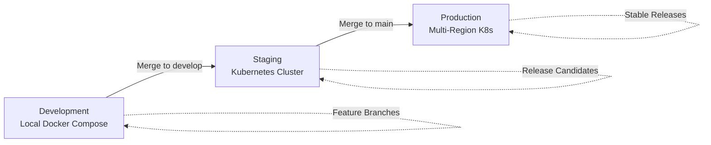
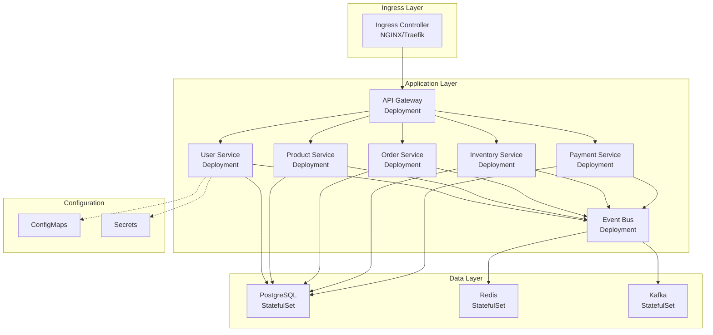
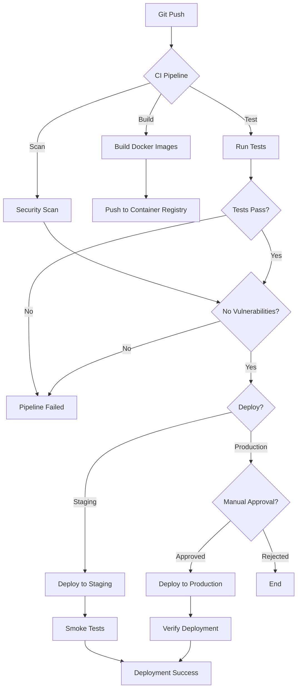
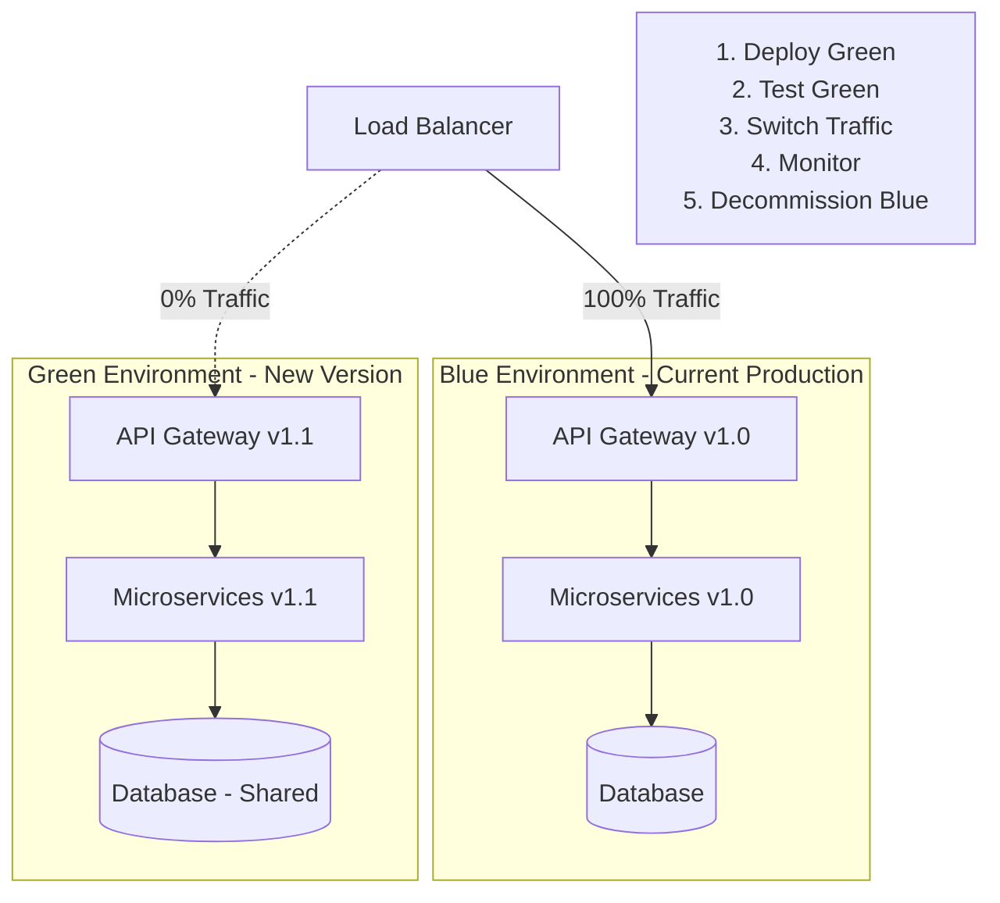
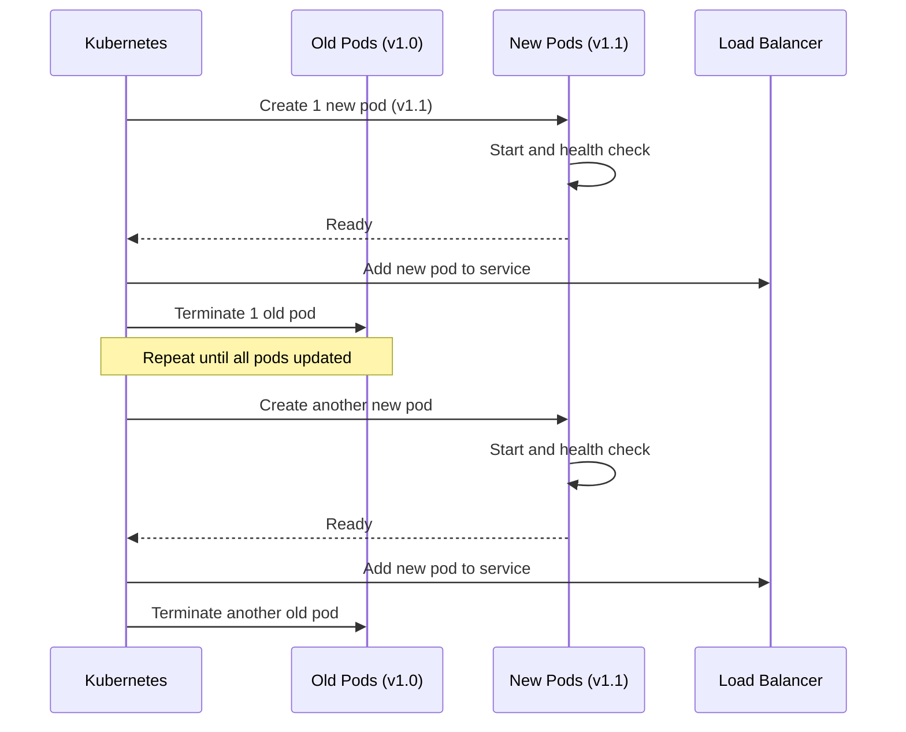
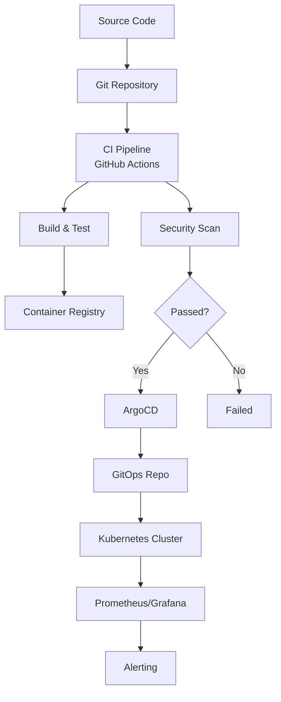

# CloudRetail Deployment Strategy

## Table of Contents
- [Overview](#overview)
- [Docker Containerization](#docker-containerization)
- [Kubernetes Deployment](#kubernetes-deployment)
- [CI/CD Pipeline](#cicd-pipeline)
- [Deployment Strategies](#deployment-strategies)
- [Blue-Green Deployment](#blue-green-deployment)
- [Rolling Updates](#rolling-updates)
- [Zero-Downtime Deployment](#zero-downtime-deployment)
- [Environment Configuration](#environment-configuration)
- [Deployment Automation](#deployment-automation)

---

## Overview

CloudRetail uses a modern containerized deployment approach with Kubernetes orchestration, automated CI/CD pipelines, and zero-downtime deployment strategies.

### Deployment Objectives

- **Zero Downtime**: Deployments without service interruption
- **Fast Rollback**: Quick revert to previous version if issues arise
- **Automated**: Minimal manual intervention
- **Consistent**: Same process across all environments
- **Secure**: Security scanning and validation
- **Auditable**: Complete deployment history and logs

### Deployment Environments



| Environment | Purpose | Infrastructure | Auto-Deploy |
|-------------|---------|----------------|-------------|
| **Development** | Local development | Docker Compose | No |
| **Staging** | Pre-production testing | Single K8s cluster | Yes (develop branch) |
| **Production** | Live environment | Multi-region K8s | Yes (main branch, with approval) |

---

## Docker Containerization

### Multi-Stage Docker Build

```dockerfile
# Example: Order Service Dockerfile

# Stage 1: Build
FROM node:20-alpine AS builder

WORKDIR /app

# Copy package files
COPY package*.json ./
COPY tsconfig.json ./

# Install dependencies
RUN npm ci --only=production && \
    npm cache clean --force

# Copy source code
COPY src/ ./src/

# Build TypeScript
RUN npm run build

# Stage 2: Production
FROM node:20-alpine AS production

# Security: Run as non-root user
RUN addgroup -g 1001 -S nodejs && \
    adduser -S nodejs -u 1001

WORKDIR /app

# Copy built artifacts from builder
COPY --from=builder --chown=nodejs:nodejs /app/node_modules ./node_modules
COPY --from=builder --chown=nodejs:nodejs /app/dist ./dist
COPY --from=builder --chown=nodejs:nodejs /app/package*.json ./

# Security: Remove unnecessary packages
RUN apk del --purge apk-tools

# Switch to non-root user
USER nodejs

# Health check
HEALTHCHECK --interval=30s --timeout=5s --start-period=30s --retries=3 \
    CMD node -e "require('http').get('http://localhost:3003/health', (r) => process.exit(r.statusCode === 200 ? 0 : 1))"

# Expose port
EXPOSE 3003

# Start application
CMD ["node", "dist/index.js"]
```

### Dockerfile Best Practices

```dockerfile
# 1. Use specific base image versions
FROM node:20.10.0-alpine3.18

# 2. Leverage build cache - copy package.json first
COPY package*.json ./
RUN npm ci
COPY . .

# 3. Multi-stage builds to reduce image size
FROM node:20-alpine AS builder
# ... build steps
FROM node:20-alpine AS production
COPY --from=builder /app/dist ./dist

# 4. Use .dockerignore to exclude unnecessary files
# .dockerignore:
# node_modules
# .git
# *.md
# tests/

# 5. Security scanning
RUN npm audit --production
RUN apk update && apk upgrade

# 6. Minimize layers
RUN apk add --no-cache \
    curl \
    ca-certificates && \
    rm -rf /var/cache/apk/*

# 7. Set environment variables
ENV NODE_ENV=production \
    PORT=3003

# 8. Add labels for metadata
LABEL maintainer="devops@cloudretail.com" \
      version="1.0.0" \
      description="CloudRetail Order Service"
```

### Docker Compose for Local Development

```yaml
# docker-compose.yml
version: '3.8'

services:
  # API Gateway
  api-gateway:
    build:
      context: .
      dockerfile: ./api-gateway/Dockerfile
      target: development
    ports:
      - "8080:8080"
    volumes:
      - ./api-gateway/src:/app/src
      - /app/node_modules
    environment:
      NODE_ENV: development
      PORT: 8080
      USER_SERVICE_URL: http://user-service:3001
      PRODUCT_SERVICE_URL: http://product-service:3002
      ORDER_SERVICE_URL: http://order-service:3003
    depends_on:
      - user-service
      - product-service
      - order-service
    networks:
      - cloudretail-network

  # Microservices
  user-service:
    build:
      context: .
      dockerfile: ./services/user-service/Dockerfile
      target: development
    ports:
      - "3001:3001"
    volumes:
      - ./services/user-service/src:/app/src
    environment:
      NODE_ENV: development
      DB_HOST: postgres-users
      DB_NAME: cloudretail_users
    depends_on:
      postgres-users:
        condition: service_healthy
    networks:
      - cloudretail-network

  # Databases
  postgres-users:
    image: postgres:15-alpine
    environment:
      POSTGRES_DB: cloudretail_users
      POSTGRES_USER: postgres
      POSTGRES_PASSWORD: postgres
    volumes:
      - postgres-users-data:/var/lib/postgresql/data
    healthcheck:
      test: ["CMD-SHELL", "pg_isready -U postgres"]
      interval: 10s
      timeout: 5s
      retries: 5
    networks:
      - cloudretail-network

volumes:
  postgres-users-data:

networks:
  cloudretail-network:
    driver: bridge
```

### Image Building and Tagging

```bash
#!/bin/bash
# build-images.sh

VERSION=$(git describe --tags --always --dirty)
REGISTRY="cloudretail.azurecr.io"
SERVICES=("api-gateway" "user-service" "product-service" "order-service" "inventory-service" "payment-service" "event-bus")

for SERVICE in "${SERVICES[@]}"; do
  echo "Building ${SERVICE}:${VERSION}"

  docker build \
    -t ${REGISTRY}/${SERVICE}:${VERSION} \
    -t ${REGISTRY}/${SERVICE}:latest \
    -f ./${SERVICE}/Dockerfile \
    .

  # Security scan
  docker scan ${REGISTRY}/${SERVICE}:${VERSION}

  # Push to registry
  docker push ${REGISTRY}/${SERVICE}:${VERSION}
  docker push ${REGISTRY}/${SERVICE}:latest
done
```

---

## Kubernetes Deployment

### Deployment Architecture



### Kubernetes Deployment Manifest

```yaml
# deployment.yaml - API Gateway
apiVersion: apps/v1
kind: Deployment
metadata:
  name: api-gateway
  namespace: cloudretail
  labels:
    app: api-gateway
    version: v1
    component: gateway
spec:
  replicas: 3
  strategy:
    type: RollingUpdate
    rollingUpdate:
      maxSurge: 1
      maxUnavailable: 0
  selector:
    matchLabels:
      app: api-gateway
  template:
    metadata:
      labels:
        app: api-gateway
        version: v1
        component: gateway
      annotations:
        prometheus.io/scrape: "true"
        prometheus.io/port: "8080"
        prometheus.io/path: "/metrics"
    spec:
      # Anti-affinity to spread pods
      affinity:
        podAntiAffinity:
          preferredDuringSchedulingIgnoredDuringExecution:
          - weight: 100
            podAffinityTerm:
              labelSelector:
                matchExpressions:
                - key: app
                  operator: In
                  values:
                  - api-gateway
              topologyKey: kubernetes.io/hostname

      # Service account
      serviceAccountName: api-gateway

      # Security context
      securityContext:
        runAsNonRoot: true
        runAsUser: 1001
        fsGroup: 1001

      containers:
      - name: api-gateway
        image: cloudretail.azurecr.io/api-gateway:v1.2.3
        imagePullPolicy: IfNotPresent

        ports:
        - name: http
          containerPort: 8080
          protocol: TCP

        # Environment from ConfigMap and Secrets
        envFrom:
        - configMapRef:
            name: api-gateway-config
        - secretRef:
            name: api-gateway-secrets

        # Resource limits
        resources:
          requests:
            cpu: 500m
            memory: 512Mi
          limits:
            cpu: 1000m
            memory: 1Gi

        # Health checks
        livenessProbe:
          httpGet:
            path: /health/live
            port: http
          initialDelaySeconds: 30
          periodSeconds: 10
          timeoutSeconds: 5
          failureThreshold: 3

        readinessProbe:
          httpGet:
            path: /health/ready
            port: http
          initialDelaySeconds: 10
          periodSeconds: 5
          timeoutSeconds: 3
          failureThreshold: 3

        startupProbe:
          httpGet:
            path: /health/startup
            port: http
          initialDelaySeconds: 0
          periodSeconds: 5
          failureThreshold: 30

        # Volume mounts
        volumeMounts:
        - name: config
          mountPath: /app/config
          readOnly: true

      volumes:
      - name: config
        configMap:
          name: api-gateway-config

      # Image pull secrets
      imagePullSecrets:
      - name: acr-credentials

---
# service.yaml
apiVersion: v1
kind: Service
metadata:
  name: api-gateway
  namespace: cloudretail
  labels:
    app: api-gateway
spec:
  type: ClusterIP
  ports:
  - port: 8080
    targetPort: http
    protocol: TCP
    name: http
  selector:
    app: api-gateway

---
# hpa.yaml
apiVersion: autoscaling/v2
kind: HorizontalPodAutoscaler
metadata:
  name: api-gateway-hpa
  namespace: cloudretail
spec:
  scaleTargetRef:
    apiVersion: apps/v1
    kind: Deployment
    name: api-gateway
  minReplicas: 3
  maxReplicas: 20
  metrics:
  - type: Resource
    resource:
      name: cpu
      target:
        type: Utilization
        averageUtilization: 70
  - type: Resource
    resource:
      name: memory
      target:
        type: Utilization
        averageUtilization: 80
```

### Ingress Configuration

```yaml
apiVersion: networking.k8s.io/v1
kind: Ingress
metadata:
  name: cloudretail-ingress
  namespace: cloudretail
  annotations:
    kubernetes.io/ingress.class: nginx
    cert-manager.io/cluster-issuer: letsencrypt-prod
    nginx.ingress.kubernetes.io/rate-limit: "100"
    nginx.ingress.kubernetes.io/ssl-redirect: "true"
spec:
  tls:
  - hosts:
    - api.cloudretail.com
    secretName: cloudretail-tls
  rules:
  - host: api.cloudretail.com
    http:
      paths:
      - path: /
        pathType: Prefix
        backend:
          service:
            name: api-gateway
            port:
              number: 8080
```

### ConfigMap and Secrets

```yaml
# configmap.yaml
apiVersion: v1
kind: ConfigMap
metadata:
  name: api-gateway-config
  namespace: cloudretail
data:
  NODE_ENV: "production"
  PORT: "8080"
  LOG_LEVEL: "info"
  USER_SERVICE_URL: "http://user-service:3001"
  PRODUCT_SERVICE_URL: "http://product-service:3002"
  ORDER_SERVICE_URL: "http://order-service:3003"
  INVENTORY_SERVICE_URL: "http://inventory-service:3004"
  PAYMENT_SERVICE_URL: "http://payment-service:3005"

---
# secrets.yaml
apiVersion: v1
kind: Secret
metadata:
  name: api-gateway-secrets
  namespace: cloudretail
type: Opaque
data:
  JWT_SECRET: <base64-encoded-secret>
  API_KEY: <base64-encoded-key>
```

---

## CI/CD Pipeline

### CI/CD Flow



### GitHub Actions Workflow

```yaml
# .github/workflows/deploy.yml
name: Build and Deploy

on:
  push:
    branches:
      - main
      - develop
  pull_request:
    branches:
      - main

env:
  REGISTRY: cloudretail.azurecr.io
  IMAGE_TAG: ${{ github.sha }}

jobs:
  # Job 1: Build and Test
  build-and-test:
    runs-on: ubuntu-latest
    steps:
      - name: Checkout code
        uses: actions/checkout@v3

      - name: Setup Node.js
        uses: actions/setup-node@v3
        with:
          node-version: '20'
          cache: 'npm'

      - name: Install dependencies
        run: npm ci

      - name: Run linting
        run: npm run lint

      - name: Run unit tests
        run: npm run test:unit

      - name: Run integration tests
        run: npm run test:integration

      - name: Generate coverage report
        run: npm run test:coverage

      - name: Upload coverage to Codecov
        uses: codecov/codecov-action@v3

  # Job 2: Build Docker Images
  build-images:
    needs: build-and-test
    runs-on: ubuntu-latest
    strategy:
      matrix:
        service:
          - api-gateway
          - user-service
          - product-service
          - order-service
          - inventory-service
          - payment-service
          - event-bus
    steps:
      - name: Checkout code
        uses: actions/checkout@v3

      - name: Login to Azure Container Registry
        uses: docker/login-action@v2
        with:
          registry: ${{ env.REGISTRY }}
          username: ${{ secrets.ACR_USERNAME }}
          password: ${{ secrets.ACR_PASSWORD }}

      - name: Build and push Docker image
        uses: docker/build-push-action@v4
        with:
          context: .
          file: ./${{ matrix.service }}/Dockerfile
          push: true
          tags: |
            ${{ env.REGISTRY }}/${{ matrix.service }}:${{ env.IMAGE_TAG }}
            ${{ env.REGISTRY }}/${{ matrix.service }}:latest
          cache-from: type=registry,ref=${{ env.REGISTRY }}/${{ matrix.service }}:buildcache
          cache-to: type=registry,ref=${{ env.REGISTRY }}/${{ matrix.service }}:buildcache,mode=max

      - name: Run Trivy vulnerability scanner
        uses: aquasecurity/trivy-action@master
        with:
          image-ref: ${{ env.REGISTRY }}/${{ matrix.service }}:${{ env.IMAGE_TAG }}
          format: 'sarif'
          output: 'trivy-results.sarif'

      - name: Upload Trivy results to GitHub Security
        uses: github/codeql-action/upload-sarif@v2
        with:
          sarif_file: 'trivy-results.sarif'

  # Job 3: Deploy to Staging
  deploy-staging:
    needs: build-images
    runs-on: ubuntu-latest
    if: github.ref == 'refs/heads/develop'
    environment:
      name: staging
      url: https://staging.cloudretail.com
    steps:
      - name: Checkout code
        uses: actions/checkout@v3

      - name: Setup kubectl
        uses: azure/setup-kubectl@v3

      - name: Set Kubernetes context
        uses: azure/k8s-set-context@v3
        with:
          method: kubeconfig
          kubeconfig: ${{ secrets.KUBE_CONFIG_STAGING }}

      - name: Update image tags
        run: |
          cd infrastructure/kubernetes
          kustomize edit set image \
            api-gateway=${{ env.REGISTRY }}/api-gateway:${{ env.IMAGE_TAG }} \
            user-service=${{ env.REGISTRY }}/user-service:${{ env.IMAGE_TAG }} \
            product-service=${{ env.REGISTRY }}/product-service:${{ env.IMAGE_TAG }} \
            order-service=${{ env.REGISTRY }}/order-service:${{ env.IMAGE_TAG }} \
            inventory-service=${{ env.REGISTRY }}/inventory-service:${{ env.IMAGE_TAG }} \
            payment-service=${{ env.REGISTRY }}/payment-service:${{ env.IMAGE_TAG }} \
            event-bus=${{ env.REGISTRY }}/event-bus:${{ env.IMAGE_TAG }}

      - name: Deploy to Kubernetes
        run: |
          kubectl apply -k infrastructure/kubernetes/

      - name: Wait for rollout
        run: |
          kubectl rollout status deployment/api-gateway -n cloudretail --timeout=5m
          kubectl rollout status deployment/user-service -n cloudretail --timeout=5m
          kubectl rollout status deployment/product-service -n cloudretail --timeout=5m
          kubectl rollout status deployment/order-service -n cloudretail --timeout=5m
          kubectl rollout status deployment/inventory-service -n cloudretail --timeout=5m
          kubectl rollout status deployment/payment-service -n cloudretail --timeout=5m

      - name: Run smoke tests
        run: |
          npm run test:smoke -- --env=staging

  # Job 4: Deploy to Production
  deploy-production:
    needs: build-images
    runs-on: ubuntu-latest
    if: github.ref == 'refs/heads/main'
    environment:
      name: production
      url: https://api.cloudretail.com
    steps:
      - name: Checkout code
        uses: actions/checkout@v3

      - name: Setup kubectl
        uses: azure/setup-kubectl@v3

      - name: Set Kubernetes context
        uses: azure/k8s-set-context@v3
        with:
          method: kubeconfig
          kubeconfig: ${{ secrets.KUBE_CONFIG_PROD }}

      - name: Update image tags
        run: |
          cd infrastructure/kubernetes
          kustomize edit set image \
            api-gateway=${{ env.REGISTRY }}/api-gateway:${{ env.IMAGE_TAG }} \
            user-service=${{ env.REGISTRY }}/user-service:${{ env.IMAGE_TAG }} \
            product-service=${{ env.REGISTRY }}/product-service:${{ env.IMAGE_TAG }} \
            order-service=${{ env.REGISTRY }}/order-service:${{ env.IMAGE_TAG }} \
            inventory-service=${{ env.REGISTRY }}/inventory-service:${{ env.IMAGE_TAG }} \
            payment-service=${{ env.REGISTRY }}/payment-service:${{ env.IMAGE_TAG }} \
            event-bus=${{ env.REGISTRY }}/event-bus:${{ env.IMAGE_TAG }}

      - name: Deploy to Production
        run: |
          kubectl apply -k infrastructure/kubernetes/

      - name: Wait for rollout
        run: |
          kubectl rollout status deployment/api-gateway -n cloudretail --timeout=10m
          kubectl rollout status deployment/user-service -n cloudretail --timeout=10m
          kubectl rollout status deployment/product-service -n cloudretail --timeout=10m
          kubectl rollout status deployment/order-service -n cloudretail --timeout=10m
          kubectl rollout status deployment/inventory-service -n cloudretail --timeout=10m
          kubectl rollout status deployment/payment-service -n cloudretail --timeout=10m

      - name: Verify deployment
        run: |
          npm run test:smoke -- --env=production

      - name: Notify Slack
        uses: 8398a7/action-slack@v3
        with:
          status: ${{ job.status }}
          text: 'Production deployment completed'
          webhook_url: ${{ secrets.SLACK_WEBHOOK }}
```

---

## Deployment Strategies

### Comparison of Deployment Strategies

| Strategy | Downtime | Resource Usage | Rollback Speed | Risk | Best For |
|----------|----------|----------------|----------------|------|----------|
| **Recreate** | Yes (minutes) | Low | Slow | High | Non-production |
| **Rolling Update** | No | Medium | Medium | Medium | Most services |
| **Blue-Green** | No | High (2x) | Instant | Low | Critical services |
| **Canary** | No | Medium | Progressive | Very Low | New features |
| **A/B Testing** | No | Medium | Progressive | Low | Feature testing |

---

## Blue-Green Deployment

### Blue-Green Architecture



### Blue-Green Deployment Implementation

```yaml
# blue-deployment.yaml (Current)
apiVersion: apps/v1
kind: Deployment
metadata:
  name: api-gateway-blue
  namespace: cloudretail
  labels:
    app: api-gateway
    version: blue
spec:
  replicas: 3
  selector:
    matchLabels:
      app: api-gateway
      version: blue
  template:
    metadata:
      labels:
        app: api-gateway
        version: blue
    spec:
      containers:
      - name: api-gateway
        image: cloudretail.azurecr.io/api-gateway:v1.0.0
        # ... container spec

---
# green-deployment.yaml (New)
apiVersion: apps/v1
kind: Deployment
metadata:
  name: api-gateway-green
  namespace: cloudretail
  labels:
    app: api-gateway
    version: green
spec:
  replicas: 3
  selector:
    matchLabels:
      app: api-gateway
      version: green
  template:
    metadata:
      labels:
        app: api-gateway
        version: green
    spec:
      containers:
      - name: api-gateway
        image: cloudretail.azurecr.io/api-gateway:v1.1.0
        # ... container spec

---
# service.yaml - Initially points to Blue
apiVersion: v1
kind: Service
metadata:
  name: api-gateway
  namespace: cloudretail
spec:
  selector:
    app: api-gateway
    version: blue        # Switch to 'green' for cutover
  ports:
  - port: 8080
    targetPort: 8080
```

### Blue-Green Deployment Script

```bash
#!/bin/bash
# blue-green-deploy.sh

set -e

NAMESPACE="cloudretail"
SERVICE_NAME="api-gateway"
NEW_VERSION="v1.1.0"

echo "Starting Blue-Green Deployment for ${SERVICE_NAME}"

# Step 1: Deploy Green environment
echo "1. Deploying Green environment..."
kubectl apply -f green-deployment.yaml -n ${NAMESPACE}

# Step 2: Wait for Green to be ready
echo "2. Waiting for Green environment to be ready..."
kubectl wait --for=condition=available \
  --timeout=5m \
  deployment/${SERVICE_NAME}-green \
  -n ${NAMESPACE}

# Step 3: Run smoke tests on Green
echo "3. Running smoke tests on Green..."
GREEN_POD=$(kubectl get pod -n ${NAMESPACE} -l app=${SERVICE_NAME},version=green -o jsonpath='{.items[0].metadata.name}')
kubectl exec -n ${NAMESPACE} ${GREEN_POD} -- npm run test:smoke

# Step 4: Switch traffic to Green
echo "4. Switching traffic to Green..."
kubectl patch service ${SERVICE_NAME} -n ${NAMESPACE} \
  -p '{"spec":{"selector":{"version":"green"}}}'

echo "5. Traffic switched to Green. Monitoring..."

# Step 6: Monitor for 5 minutes
echo "6. Monitoring for 5 minutes..."
sleep 300

# Step 7: Check error rates
ERROR_RATE=$(kubectl exec -n ${NAMESPACE} ${GREEN_POD} -- curl -s localhost:8080/metrics | grep error_rate | awk '{print $2}')

if (( $(echo "${ERROR_RATE} > 0.01" | bc -l) )); then
  echo "ERROR: High error rate detected (${ERROR_RATE}). Rolling back!"
  kubectl patch service ${SERVICE_NAME} -n ${NAMESPACE} \
    -p '{"spec":{"selector":{"version":"blue"}}}'
  exit 1
fi

echo "7. Deployment successful! Scaling down Blue..."
kubectl scale deployment/${SERVICE_NAME}-blue --replicas=0 -n ${NAMESPACE}

echo "Blue-Green deployment completed successfully!"
```

---

## Rolling Updates

### Rolling Update Strategy



### Rolling Update Configuration

```yaml
apiVersion: apps/v1
kind: Deployment
metadata:
  name: order-service
  namespace: cloudretail
spec:
  replicas: 6
  strategy:
    type: RollingUpdate
    rollingUpdate:
      maxSurge: 2           # Max 2 extra pods during update
      maxUnavailable: 0     # Always maintain full capacity
  template:
    spec:
      containers:
      - name: order-service
        image: cloudretail.azurecr.io/order-service:v1.1.0
        readinessProbe:
          httpGet:
            path: /health/ready
            port: 3003
          initialDelaySeconds: 10
          periodSeconds: 5
          failureThreshold: 3
        lifecycle:
          preStop:
            exec:
              command: ["/bin/sh", "-c", "sleep 15"]
```

### Rolling Update Commands

```bash
# Update deployment image
kubectl set image deployment/order-service \
  order-service=cloudretail.azurecr.io/order-service:v1.1.0 \
  -n cloudretail

# Watch rollout status
kubectl rollout status deployment/order-service -n cloudretail

# Pause rollout (if issues detected)
kubectl rollout pause deployment/order-service -n cloudretail

# Resume rollout
kubectl rollout resume deployment/order-service -n cloudretail

# Rollback to previous version
kubectl rollout undo deployment/order-service -n cloudretail

# Rollback to specific revision
kubectl rollout undo deployment/order-service --to-revision=2 -n cloudretail

# View rollout history
kubectl rollout history deployment/order-service -n cloudretail
```

---

## Zero-Downtime Deployment

### Zero-Downtime Checklist

- [ ] **Health Checks Configured**
  - Readiness probes ensure only healthy pods receive traffic
  - Liveness probes restart unhealthy pods

- [ ] **Graceful Shutdown**
  - PreStop hooks to drain connections
  - SIGTERM handling for clean shutdown

- [ ] **Rolling Update Strategy**
  - maxUnavailable: 0
  - maxSurge: 1 or more

- [ ] **Pod Disruption Budget**
  - Minimum available pods during updates

- [ ] **Database Migrations**
  - Backward-compatible schema changes
  - Run migrations before deployment

- [ ] **Connection Draining**
  - Allow in-flight requests to complete

### Graceful Shutdown Implementation

```typescript
// Graceful shutdown handler
let isShuttingDown = false;

process.on('SIGTERM', async () => {
  if (isShuttingDown) return;
  isShuttingDown = true;

  logger.info('SIGTERM received, starting graceful shutdown');

  // Step 1: Stop accepting new requests
  server.close(() => {
    logger.info('HTTP server closed');
  });

  // Step 2: Mark as unhealthy for readiness probe
  app.get('/health/ready', (req, res) => {
    res.status(503).json({ status: 'shutting down' });
  });

  // Step 3: Wait for in-flight requests to complete (max 30 seconds)
  await sleep(30000);

  // Step 4: Close database connections
  await sequelize.close();
  logger.info('Database connections closed');

  // Step 5: Close event bus connection
  await eventBus.disconnect();
  logger.info('Event bus disconnected');

  // Step 6: Exit
  logger.info('Graceful shutdown complete');
  process.exit(0);
});

// PreStop hook in Kubernetes (lifecycle.preStop)
# In deployment.yaml:
lifecycle:
  preStop:
    exec:
      command: ["/bin/sh", "-c", "sleep 15"]
```

### Pod Disruption Budget

```yaml
apiVersion: policy/v1
kind: PodDisruptionBudget
metadata:
  name: api-gateway-pdb
  namespace: cloudretail
spec:
  minAvailable: 2
  selector:
    matchLabels:
      app: api-gateway

---
apiVersion: policy/v1
kind: PodDisruptionBudget
metadata:
  name: order-service-pdb
  namespace: cloudretail
spec:
  maxUnavailable: 1
  selector:
    matchLabels:
      app: order-service
```

### Database Migration Strategy

```typescript
// Run migrations before deployment
// migrations/20260201000000-add-user-preferences.ts

export async function up(queryInterface: QueryInterface) {
  // Add column with default value (backward compatible)
  await queryInterface.addColumn('users', 'preferences', {
    type: DataTypes.JSONB,
    defaultValue: {},
    allowNull: false
  });
}

export async function down(queryInterface: QueryInterface) {
  await queryInterface.removeColumn('users', 'preferences');
}

// Run migrations in init container
# In deployment.yaml:
initContainers:
- name: db-migration
  image: cloudretail.azurecr.io/user-service:v1.1.0
  command: ['npm', 'run', 'migrate']
  env:
  - name: DB_HOST
    value: postgres-users
```

---

## Environment Configuration

### Environment Variables Management

```yaml
# base/configmap.yaml
apiVersion: v1
kind: ConfigMap
metadata:
  name: common-config
data:
  LOG_LEVEL: "info"
  NODE_ENV: "production"

---
# overlays/staging/configmap.yaml
apiVersion: v1
kind: ConfigMap
metadata:
  name: common-config
data:
  LOG_LEVEL: "debug"
  ALLOWED_ORIGINS: "https://staging.cloudretail.com"

---
# overlays/production/configmap.yaml
apiVersion: v1
kind: ConfigMap
metadata:
  name: common-config
data:
  LOG_LEVEL: "warn"
  ALLOWED_ORIGINS: "https://cloudretail.com"
```

### Kustomize for Environment Management

```yaml
# base/kustomization.yaml
apiVersion: kustomize.config.k8s.io/v1beta1
kind: Kustomization

resources:
  - namespace.yaml
  - configmap.yaml
  - secrets.yaml
  - deployments/
  - services/
  - ingress.yaml

---
# overlays/staging/kustomization.yaml
apiVersion: kustomize.config.k8s.io/v1beta1
kind: Kustomization

bases:
  - ../../base

namespace: cloudretail-staging

patches:
  - patch: |-
      - op: replace
        path: /spec/replicas
        value: 2
    target:
      kind: Deployment

configMapGenerator:
  - name: common-config
    behavior: merge
    literals:
      - LOG_LEVEL=debug
      - NODE_ENV=staging

---
# overlays/production/kustomization.yaml
apiVersion: kustomize.config.k8s.io/v1beta1
kind: Kustomization

bases:
  - ../../base

namespace: cloudretail

patches:
  - patch: |-
      - op: replace
        path: /spec/replicas
        value: 6
    target:
      kind: Deployment
      name: api-gateway

configMapGenerator:
  - name: common-config
    behavior: merge
    literals:
      - LOG_LEVEL=warn
      - NODE_ENV=production
```

### Deploy with Kustomize

```bash
# Deploy to staging
kubectl apply -k infrastructure/kubernetes/overlays/staging/

# Deploy to production
kubectl apply -k infrastructure/kubernetes/overlays/production/
```

---

## Deployment Automation

### Deployment Automation Tools



### ArgoCD for GitOps

```yaml
# argocd-application.yaml
apiVersion: argoproj.io/v1alpha1
kind: Application
metadata:
  name: cloudretail
  namespace: argocd
spec:
  project: default
  source:
    repoURL: https://github.com/cloudretail/infrastructure
    targetRevision: main
    path: kubernetes/overlays/production
  destination:
    server: https://kubernetes.default.svc
    namespace: cloudretail
  syncPolicy:
    automated:
      prune: true
      selfHeal: true
      allowEmpty: false
    syncOptions:
      - CreateNamespace=true
    retry:
      limit: 5
      backoff:
        duration: 5s
        factor: 2
        maxDuration: 3m
```

### Deployment Monitoring

```typescript
// Deployment health check
async function verifyDeployment(serviceName: string, version: string): Promise<boolean> {
  const checks = [
    checkPodStatus(serviceName),
    checkEndpointHealth(serviceName),
    checkErrorRates(serviceName),
    checkLatency(serviceName)
  ];

  const results = await Promise.all(checks);
  const allHealthy = results.every(r => r === true);

  if (!allHealthy) {
    logger.error('Deployment verification failed', {
      serviceName,
      version,
      results
    });

    // Auto-rollback if deployment fails
    await rollbackDeployment(serviceName);
    return false;
  }

  logger.info('Deployment verified successfully', {
    serviceName,
    version
  });

  return true;
}
```

---

## Summary

CloudRetail's deployment strategy ensures:

- **Containerization**: Docker multi-stage builds for optimized images
- **Orchestration**: Kubernetes for automated deployment and scaling
- **CI/CD**: Automated pipelines with GitHub Actions
- **Zero Downtime**: Rolling updates with health checks and graceful shutdown
- **Multiple Strategies**: Blue-green, rolling updates, canary deployments
- **GitOps**: Infrastructure as code with ArgoCD
- **Environment Management**: Kustomize for multi-environment configuration
- **Monitoring**: Automated verification and rollback

The platform supports rapid, safe deployments with minimal manual intervention and zero customer impact.
