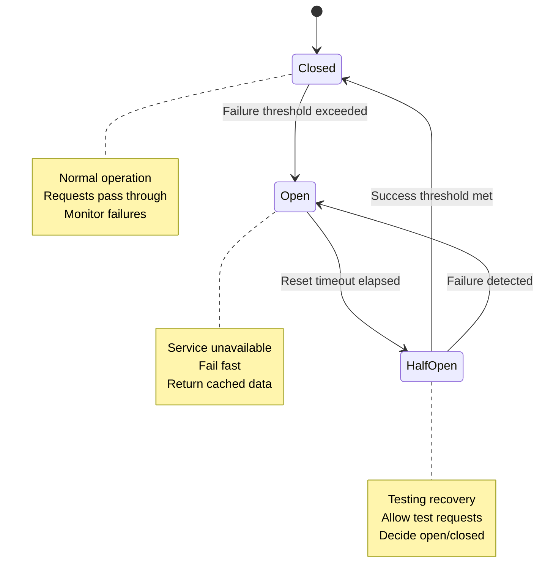
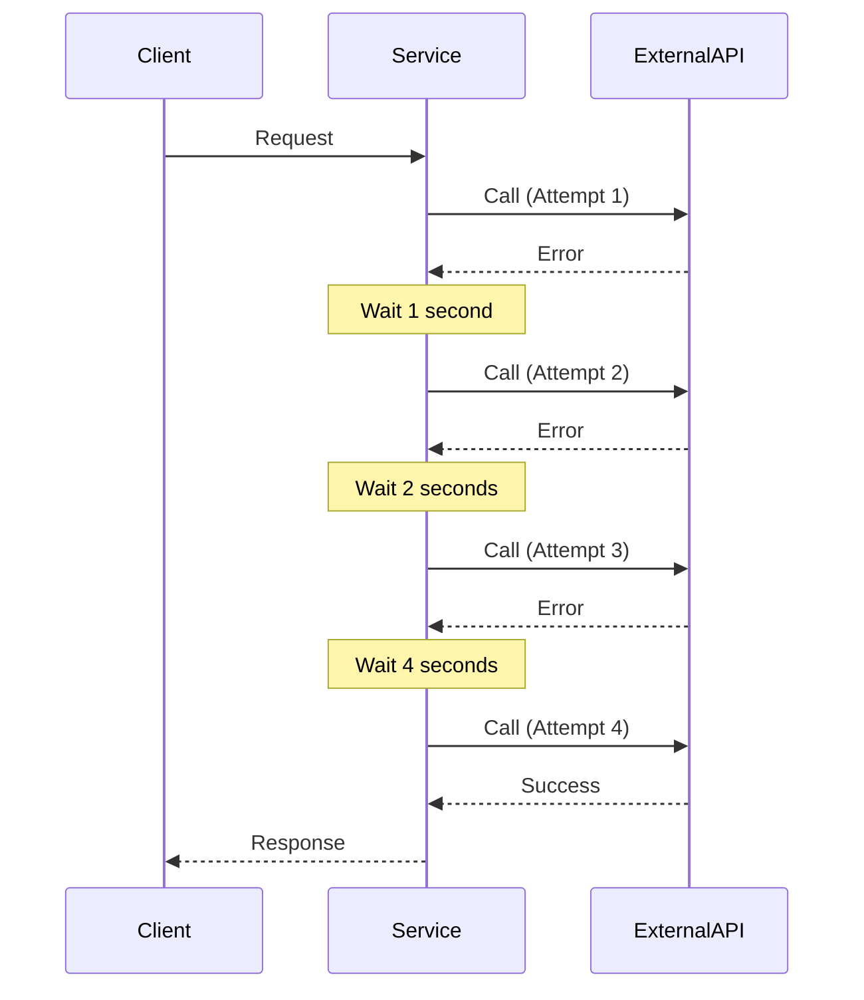
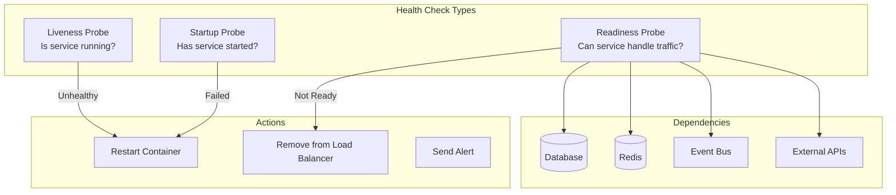
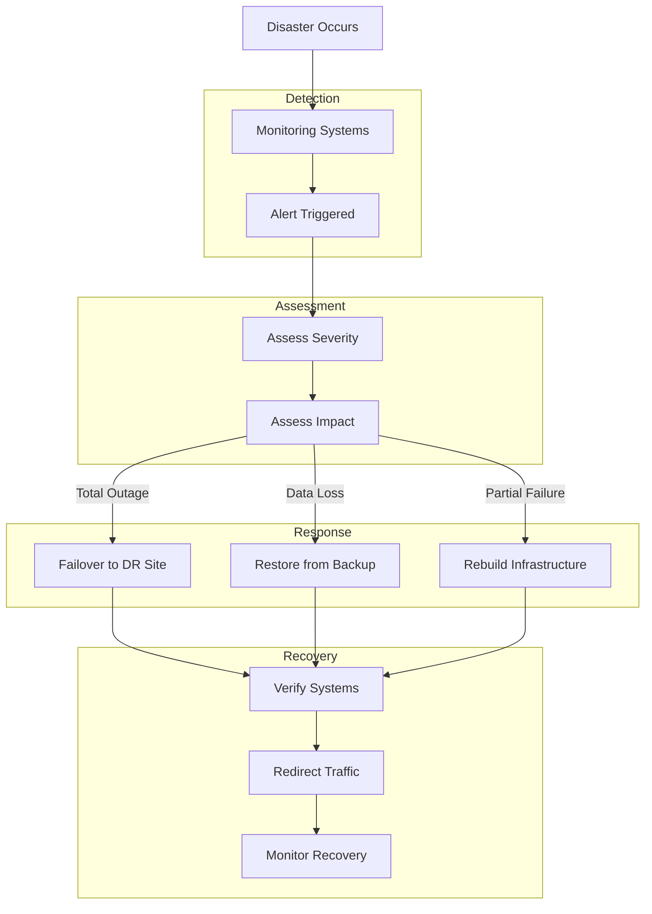
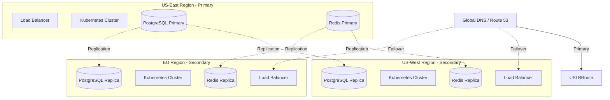
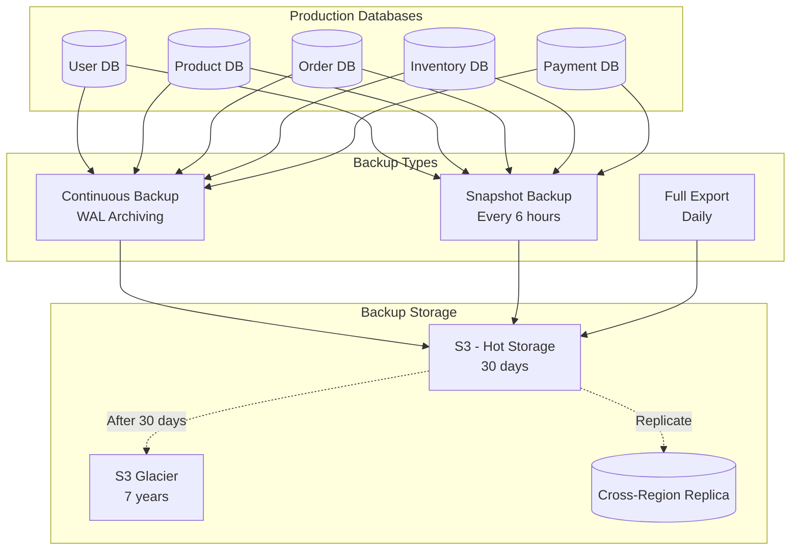
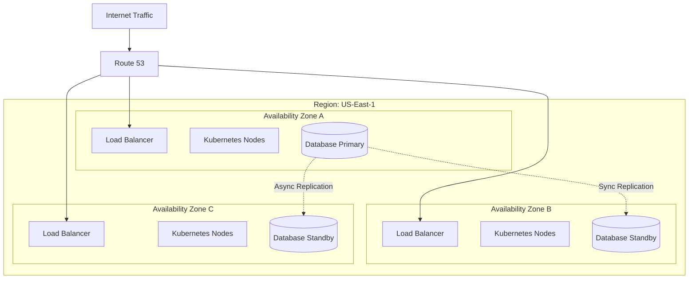

# CloudRetail Fault Tolerance and Resilience

## Table of Contents
- [Overview](#overview)
- [Circuit Breakers](#circuit-breakers)
- [Retry Policies with Exponential Backoff](#retry-policies-with-exponential-backoff)
- [Health Checks and Monitoring](#health-checks-and-monitoring)
- [Disaster Recovery](#disaster-recovery)
- [Data Backup Strategies](#data-backup-strategies)
- [High Availability Zones](#high-availability-zones)
- [Graceful Degradation](#graceful-degradation)
- [Chaos Engineering](#chaos-engineering)
- [Incident Response](#incident-response)

---

## Overview

CloudRetail is designed with fault tolerance at its core, ensuring the platform remains available and operational even when components fail. The architecture implements multiple resilience patterns and practices.

### Fault Tolerance Goals

- **High Availability**: 99.99% uptime (52 minutes downtime/year)
- **Mean Time to Recovery (MTTR)**: < 5 minutes
- **Mean Time Between Failures (MTBF)**: > 720 hours (30 days)
- **Zero Data Loss**: RPO (Recovery Point Objective) = 0
- **Fast Recovery**: RTO (Recovery Time Objective) < 1 hour

### Resilience Principles

1. **Fail Fast**: Detect failures quickly and respond appropriately
2. **Fail Safely**: Degrade gracefully rather than complete failure
3. **Isolation**: Failures in one component don't cascade
4. **Redundancy**: No single point of failure
5. **Self-Healing**: Automatic recovery from failures
6. **Observability**: Monitor and alert on anomalies

---

## Circuit Breakers

Circuit breakers prevent cascading failures by stopping requests to failing services.

### Circuit Breaker States



### Circuit Breaker Implementation

```typescript
import CircuitBreaker from 'opossum';

// Circuit Breaker Configuration
const circuitBreakerOptions = {
  timeout: 5000,                      // 5 second timeout
  errorThresholdPercentage: 50,       // Open after 50% failures
  resetTimeout: 30000,                // Try to close after 30 seconds
  rollingCountTimeout: 10000,         // 10 second rolling window
  rollingCountBuckets: 10,            // Number of buckets in window
  name: 'order-service-breaker',
  volumeThreshold: 10                 // Minimum requests before opening
};

// Create Circuit Breaker
const breaker = new CircuitBreaker(callOrderService, circuitBreakerOptions);

// Event Handlers
breaker.on('open', () => {
  logger.warn('Circuit breaker opened for order-service');
  metrics.increment('circuit_breaker.open', { service: 'order-service' });
});

breaker.on('halfOpen', () => {
  logger.info('Circuit breaker half-open for order-service');
  metrics.increment('circuit_breaker.halfopen', { service: 'order-service' });
});

breaker.on('close', () => {
  logger.info('Circuit breaker closed for order-service');
  metrics.increment('circuit_breaker.close', { service: 'order-service' });
});

breaker.on('failure', (error) => {
  logger.error('Circuit breaker failure', { error: error.message });
});

breaker.on('timeout', () => {
  logger.warn('Circuit breaker timeout');
  metrics.increment('circuit_breaker.timeout', { service: 'order-service' });
});

breaker.on('reject', () => {
  logger.warn('Circuit breaker rejected request');
  metrics.increment('circuit_breaker.reject', { service: 'order-service' });
});

// Fallback Function
breaker.fallback((error) => {
  logger.info('Using circuit breaker fallback', { error: error.message });

  // Return cached data or default response
  return getCachedOrderData() || {
    success: false,
    error: {
      code: 'SERVICE_UNAVAILABLE',
      message: 'Order service is temporarily unavailable. Please try again later.'
    }
  };
});
```

### Service-Specific Circuit Breakers

```typescript
class ServiceCircuitBreakers {
  private breakers: Map<string, CircuitBreaker> = new Map();

  constructor() {
    this.initializeBreakers();
  }

  private initializeBreakers() {
    const services = [
      { name: 'user-service', url: process.env.USER_SERVICE_URL, timeout: 3000 },
      { name: 'product-service', url: process.env.PRODUCT_SERVICE_URL, timeout: 3000 },
      { name: 'order-service', url: process.env.ORDER_SERVICE_URL, timeout: 5000 },
      { name: 'inventory-service', url: process.env.INVENTORY_SERVICE_URL, timeout: 3000 },
      { name: 'payment-service', url: process.env.PAYMENT_SERVICE_URL, timeout: 10000 }
    ];

    for (const service of services) {
      const breaker = new CircuitBreaker(
        (options) => this.makeRequest(service.url, options),
        {
          timeout: service.timeout,
          errorThresholdPercentage: 50,
          resetTimeout: 30000,
          name: service.name
        }
      );

      this.breakers.set(service.name, breaker);
    }
  }

  async call(serviceName: string, options: RequestOptions): Promise<any> {
    const breaker = this.breakers.get(serviceName);
    if (!breaker) {
      throw new Error(`Circuit breaker not found for service: ${serviceName}`);
    }

    return breaker.fire(options);
  }

  private async makeRequest(baseUrl: string, options: RequestOptions): Promise<any> {
    const response = await fetch(`${baseUrl}${options.path}`, {
      method: options.method,
      headers: options.headers,
      body: options.body
    });

    if (!response.ok) {
      throw new Error(`Request failed: ${response.status}`);
    }

    return response.json();
  }
}
```

### Circuit Breaker Monitoring

```typescript
// Prometheus Metrics
const circuitBreakerMetrics = {
  state: new Gauge({
    name: 'circuit_breaker_state',
    help: 'Circuit breaker state (0=closed, 1=open, 2=half_open)',
    labelNames: ['service']
  }),
  failures: new Counter({
    name: 'circuit_breaker_failures_total',
    help: 'Total circuit breaker failures',
    labelNames: ['service']
  }),
  successes: new Counter({
    name: 'circuit_breaker_successes_total',
    help: 'Total circuit breaker successes',
    labelNames: ['service']
  }),
  timeouts: new Counter({
    name: 'circuit_breaker_timeouts_total',
    help: 'Total circuit breaker timeouts',
    labelNames: ['service']
  })
};
```

---

## Retry Policies with Exponential Backoff

### Retry Strategy



### Exponential Backoff Implementation

```typescript
/**
 * Retry with Exponential Backoff
 * Retries failed operations with increasing delays
 */
async function retryWithBackoff<T>(
  fn: () => Promise<T>,
  maxRetries: number = 3,
  baseDelay: number = 1000,
  maxDelay: number = 30000,
  jitter: boolean = true
): Promise<T> {
  let lastError: Error;

  for (let attempt = 0; attempt < maxRetries; attempt++) {
    try {
      return await fn();
    } catch (error) {
      lastError = error as Error;

      if (attempt < maxRetries - 1) {
        // Calculate delay with exponential backoff
        let delay = Math.min(baseDelay * Math.pow(2, attempt), maxDelay);

        // Add jitter to prevent thundering herd
        if (jitter) {
          delay = delay * (0.5 + Math.random() * 0.5);
        }

        logger.info(`Retry attempt ${attempt + 1}/${maxRetries} after ${delay}ms`, {
          error: error.message
        });

        await sleep(delay);
      }
    }
  }

  throw new Error(`Failed after ${maxRetries} retries: ${lastError!.message}`);
}

function sleep(ms: number): Promise<void> {
  return new Promise(resolve => setTimeout(resolve, ms));
}
```

### Retry Configuration by Operation

```typescript
const retryConfigs = {
  // Database queries - quick retries
  database: {
    maxRetries: 3,
    baseDelay: 100,
    maxDelay: 1000,
    retryableErrors: ['ECONNREFUSED', 'ETIMEDOUT', 'ENOTFOUND']
  },

  // External API calls - longer delays
  externalApi: {
    maxRetries: 5,
    baseDelay: 1000,
    maxDelay: 30000,
    retryableErrors: ['ECONNREFUSED', 'ETIMEDOUT', 'ENOTFOUND', '500', '502', '503', '504']
  },

  // Payment processing - careful retries
  payment: {
    maxRetries: 2,
    baseDelay: 2000,
    maxDelay: 5000,
    retryableErrors: ['ETIMEDOUT', '503'],
    idempotencyKey: true  // Prevent duplicate charges
  },

  // Event publishing - aggressive retries
  eventPublishing: {
    maxRetries: 10,
    baseDelay: 500,
    maxDelay: 10000,
    retryableErrors: ['ECONNREFUSED', 'ETIMEDOUT']
  }
};

// Usage
async function makePayment(paymentData: PaymentData): Promise<PaymentResult> {
  const config = retryConfigs.payment;

  return retryWithBackoff(
    async () => {
      return await paymentGateway.charge(paymentData);
    },
    config.maxRetries,
    config.baseDelay,
    config.maxDelay
  );
}
```

### Idempotent Operations

```typescript
/**
 * Idempotency Key for safe retries
 * Prevents duplicate operations on retries
 */
class IdempotencyManager {
  private redis: RedisClient;

  async executeIdempotent<T>(
    key: string,
    fn: () => Promise<T>,
    ttl: number = 86400  // 24 hours
  ): Promise<T> {
    // Check if already processed
    const existing = await this.redis.get(`idempotency:${key}`);
    if (existing) {
      logger.info('Idempotency key found, returning cached result', { key });
      return JSON.parse(existing);
    }

    // Execute and cache result
    const result = await fn();
    await this.redis.setEx(
      `idempotency:${key}`,
      ttl,
      JSON.stringify(result)
    );

    return result;
  }
}

// Usage in payment processing
async function processPayment(orderId: string, paymentData: PaymentData): Promise<PaymentResult> {
  const idempotencyKey = `payment:${orderId}`;

  return idempotencyManager.executeIdempotent(
    idempotencyKey,
    async () => {
      return await paymentGateway.charge({
        ...paymentData,
        idempotencyKey
      });
    }
  );
}
```

---

## Health Checks and Monitoring

### Health Check Architecture



### Health Check Implementation

```typescript
import { HealthCheck, HealthStatus } from '@cloudretail/middleware';

class ServiceHealth {
  private healthCheck: HealthCheck;

  constructor() {
    this.healthCheck = new HealthCheck();
    this.registerChecks();
  }

  private registerChecks() {
    // Database health check
    this.healthCheck.registerCheck('database', async () => {
      try {
        await sequelize.authenticate();
        return true;
      } catch (error) {
        logger.error('Database health check failed', { error });
        return false;
      }
    });

    // Redis health check
    this.healthCheck.registerCheck('cache', async () => {
      try {
        await redis.ping();
        return true;
      } catch (error) {
        logger.error('Redis health check failed', { error });
        return false;
      }
    });

    // Event Bus health check
    this.healthCheck.registerCheck('eventBus', async () => {
      try {
        return eventBus.isConnected();
      } catch (error) {
        logger.error('Event Bus health check failed', { error });
        return false;
      }
    });

    // Disk space check
    this.healthCheck.registerCheck('diskSpace', async () => {
      const usage = await checkDiskUsage();
      return usage < 90;  // Fail if > 90% used
    });

    // Memory check
    this.healthCheck.registerCheck('memory', async () => {
      const usage = process.memoryUsage();
      const percentUsed = (usage.heapUsed / usage.heapTotal) * 100;
      return percentUsed < 90;  // Fail if > 90% used
    });
  }

  async getStatus(): Promise<HealthStatus> {
    return this.healthCheck.getStatus();
  }
}

// Health check endpoints
app.get('/health/live', (req, res) => {
  // Liveness: Is the service running?
  res.status(200).json({
    status: 'alive',
    timestamp: new Date(),
    uptime: process.uptime()
  });
});

app.get('/health/ready', async (req, res) => {
  // Readiness: Can the service handle traffic?
  const status = await serviceHealth.getStatus();

  const statusCode = status.status === 'healthy' ? 200 : 503;
  res.status(statusCode).json(status);
});

app.get('/health/startup', async (req, res) => {
  // Startup: Has the service fully started?
  const started = await checkStartupComplete();

  res.status(started ? 200 : 503).json({
    status: started ? 'ready' : 'starting',
    timestamp: new Date()
  });
});
```

### Kubernetes Probe Configuration

```yaml
apiVersion: apps/v1
kind: Deployment
metadata:
  name: order-service
spec:
  template:
    spec:
      containers:
      - name: order-service
        image: cloudretail/order-service:latest
        ports:
        - containerPort: 3003

        # Liveness Probe - Restart if unhealthy
        livenessProbe:
          httpGet:
            path: /health/live
            port: 3003
          initialDelaySeconds: 30
          periodSeconds: 10
          timeoutSeconds: 5
          failureThreshold: 3
          successThreshold: 1

        # Readiness Probe - Remove from service if not ready
        readinessProbe:
          httpGet:
            path: /health/ready
            port: 3003
          initialDelaySeconds: 10
          periodSeconds: 5
          timeoutSeconds: 3
          failureThreshold: 3
          successThreshold: 1

        # Startup Probe - Allow time for slow startup
        startupProbe:
          httpGet:
            path: /health/startup
            port: 3003
          initialDelaySeconds: 0
          periodSeconds: 5
          timeoutSeconds: 3
          failureThreshold: 30      # 30 * 5s = 150s max startup time
          successThreshold: 1
```

### Monitoring and Alerting

```typescript
// Prometheus Metrics
const healthMetrics = {
  status: new Gauge({
    name: 'service_health_status',
    help: 'Service health status (1=healthy, 0=unhealthy)',
    labelNames: ['component']
  }),
  checkDuration: new Histogram({
    name: 'health_check_duration_seconds',
    help: 'Health check duration',
    labelNames: ['check'],
    buckets: [0.01, 0.05, 0.1, 0.5, 1, 2, 5]
  }),
  failures: new Counter({
    name: 'health_check_failures_total',
    help: 'Total health check failures',
    labelNames: ['check']
  })
};

// Alert on health check failures
const alertConfig = {
  database: {
    threshold: 3,               // Alert after 3 consecutive failures
    severity: 'critical',
    channels: ['pagerduty', 'slack']
  },
  cache: {
    threshold: 5,
    severity: 'warning',
    channels: ['slack']
  }
};
```

---

## Disaster Recovery

### Disaster Recovery Plan



### Multi-Region Architecture



### RTO and RPO

| Disaster Scenario | RPO | RTO | Recovery Strategy |
|------------------|-----|-----|-------------------|
| **Single Pod Failure** | 0 | < 1 minute | Kubernetes auto-restart |
| **Node Failure** | 0 | < 2 minutes | Pod rescheduling |
| **Availability Zone Failure** | 0 | < 5 minutes | Multi-AZ deployment |
| **Region Failure** | < 5 minutes | < 30 minutes | Cross-region failover |
| **Database Corruption** | < 15 minutes | < 1 hour | Point-in-time recovery |
| **Complete Data Center Loss** | < 15 minutes | < 2 hours | DR site activation |

### Failover Procedures

#### Automated Failover

```typescript
class FailoverManager {
  private healthCheckInterval: NodeJS.Timeout;
  private failoverThreshold = 3;      // Consecutive failures
  private failureCount = 0;

  startMonitoring() {
    this.healthCheckInterval = setInterval(async () => {
      const healthy = await this.checkPrimaryRegion();

      if (!healthy) {
        this.failureCount++;
        logger.warn(`Primary region unhealthy (${this.failureCount}/${this.failoverThreshold})`);

        if (this.failureCount >= this.failoverThreshold) {
          await this.initiateFailover();
        }
      } else {
        this.failureCount = 0;
      }
    }, 10000);  // Check every 10 seconds
  }

  async initiateFailover() {
    logger.critical('Initiating failover to secondary region');

    try {
      // 1. Promote secondary database to primary
      await this.promoteDatabaseReplica('us-west');

      // 2. Update DNS to point to secondary region
      await this.updateDNS('us-west');

      // 3. Scale up secondary region
      await this.scaleSecondaryRegion('us-west', 'full');

      // 4. Notify team
      await this.sendAlert({
        severity: 'critical',
        message: 'Failover to US-West completed',
        channels: ['pagerduty', 'slack']
      });

      logger.info('Failover completed successfully');
    } catch (error) {
      logger.error('Failover failed', { error });
      throw error;
    }
  }
}
```

#### Manual Failover Checklist

1. **Assess Situation**
   - [ ] Confirm primary region is down
   - [ ] Verify secondary region is healthy
   - [ ] Check data replication lag

2. **Prepare Secondary Region**
   - [ ] Promote database replica to primary
   - [ ] Scale up pod replicas
   - [ ] Verify application health

3. **Switch Traffic**
   - [ ] Update DNS records
   - [ ] Verify traffic routing
   - [ ] Monitor error rates

4. **Post-Failover**
   - [ ] Notify stakeholders
   - [ ] Document incident
   - [ ] Plan primary region recovery

---

## Data Backup Strategies

### Backup Architecture



### PostgreSQL Backup Configuration

```bash
#!/bin/bash
# PostgreSQL Continuous Archiving (WAL)

# postgresql.conf
wal_level = replica
archive_mode = on
archive_command = 'aws s3 cp %p s3://cloudretail-backups/wal/%f'
archive_timeout = 300  # Force WAL switch every 5 minutes

# Backup script
#!/bin/bash
DATE=$(date +%Y%m%d_%H%M%S)
BACKUP_DIR="/backups"
S3_BUCKET="s3://cloudretail-backups"

# Full backup using pg_basebackup
pg_basebackup -D ${BACKUP_DIR}/${DATE} -Ft -z -P

# Upload to S3
aws s3 sync ${BACKUP_DIR}/${DATE} ${S3_BUCKET}/basebackup/${DATE}/

# Cleanup old local backups (keep last 3)
ls -t ${BACKUP_DIR} | tail -n +4 | xargs -I {} rm -rf ${BACKUP_DIR}/{}
```

### Backup Schedule

| Backup Type | Frequency | Retention | Storage | Purpose |
|-------------|-----------|-----------|---------|---------|
| **WAL Archiving** | Continuous | 30 days | S3 | Point-in-time recovery |
| **Snapshot** | Every 6 hours | 7 days | S3 | Quick recovery |
| **Full Backup** | Daily at 2 AM | 30 days | S3 | Complete restore |
| **Weekly Backup** | Sunday 2 AM | 90 days | S3 Glacier | Long-term retention |
| **Monthly Backup** | 1st of month | 7 years | S3 Glacier | Compliance |

### Backup Verification

```typescript
class BackupVerification {
  async verifyBackup(backupId: string): Promise<boolean> {
    try {
      // 1. Download backup
      const backupPath = await this.downloadBackup(backupId);

      // 2. Restore to test database
      await this.restoreToTestDB(backupPath);

      // 3. Run validation queries
      const valid = await this.validateData();

      // 4. Cleanup test database
      await this.cleanupTestDB();

      logger.info('Backup verification completed', {
        backupId,
        valid
      });

      return valid;
    } catch (error) {
      logger.error('Backup verification failed', {
        backupId,
        error
      });
      return false;
    }
  }
}

// Scheduled verification (weekly)
cron.schedule('0 3 * * 0', async () => {
  const latestBackup = await getLatestBackup();
  await backupVerification.verifyBackup(latestBackup.id);
});
```

### Point-in-Time Recovery

```bash
#!/bin/bash
# Restore database to specific point in time

RESTORE_POINT="2026-02-01 12:00:00"
BACKUP_ID="20260201_000000"
RESTORE_DIR="/restore"

# 1. Extract base backup
aws s3 sync s3://cloudretail-backups/basebackup/${BACKUP_ID}/ ${RESTORE_DIR}/

# 2. Create recovery.conf
cat > ${RESTORE_DIR}/recovery.conf <<EOF
restore_command = 'aws s3 cp s3://cloudretail-backups/wal/%f %p'
recovery_target_time = '${RESTORE_POINT}'
recovery_target_action = 'promote'
EOF

# 3. Start PostgreSQL with recovery
pg_ctl -D ${RESTORE_DIR} start

# PostgreSQL will replay WAL logs until recovery_target_time
```

---

## High Availability Zones

### Multi-AZ Deployment



### Pod Anti-Affinity

```yaml
# Ensure pods are spread across different zones
apiVersion: apps/v1
kind: Deployment
metadata:
  name: order-service
spec:
  replicas: 6
  template:
    spec:
      # Anti-affinity rules
      affinity:
        podAntiAffinity:
          # Prefer different zones
          preferredDuringSchedulingIgnoredDuringExecution:
          - weight: 100
            podAffinityTerm:
              labelSelector:
                matchExpressions:
                - key: app
                  operator: In
                  values:
                  - order-service
              topologyKey: topology.kubernetes.io/zone

          # Require different nodes
          requiredDuringSchedulingIgnoredDuringExecution:
          - labelSelector:
              matchExpressions:
              - key: app
                operator: In
                values:
                - order-service
            topologyKey: kubernetes.io/hostname
```

### Database High Availability

```yaml
# PostgreSQL StatefulSet with Multi-AZ
apiVersion: apps/v1
kind: StatefulSet
metadata:
  name: postgres
spec:
  replicas: 3
  template:
    spec:
      affinity:
        podAntiAffinity:
          requiredDuringSchedulingIgnoredDuringExecution:
          - labelSelector:
              matchLabels:
                app: postgres
            topologyKey: topology.kubernetes.io/zone

      containers:
      - name: postgres
        image: postgres:15-alpine
        env:
        - name: POSTGRES_REPLICATION
          value: "true"
```

---

## Graceful Degradation

### Degradation Strategies

```typescript
class GracefulDegradation {
  async handleServiceFailure(service: string, operation: string): Promise<any> {
    logger.warn(`Service ${service} unavailable, using degraded mode`);

    switch (service) {
      case 'product-service':
        return this.degradedProductService(operation);

      case 'inventory-service':
        return this.degradedInventoryService(operation);

      case 'payment-service':
        return this.degradedPaymentService(operation);

      default:
        throw new Error(`No degradation strategy for ${service}`);
    }
  }

  // Return cached product data when product service is down
  private async degradedProductService(operation: string): Promise<any> {
    if (operation === 'getProducts') {
      const cached = await redis.get('products:cached');
      if (cached) {
        return {
          success: true,
          data: JSON.parse(cached),
          degraded: true,
          message: 'Showing cached product catalog'
        };
      }
    }

    throw new Error('Product service unavailable');
  }

  // Allow orders without real-time inventory check
  private async degradedInventoryService(operation: string): Promise<any> {
    if (operation === 'checkStock') {
      logger.warn('Inventory service down, allowing optimistic ordering');
      return {
        success: true,
        available: true,
        degraded: true,
        message: 'Stock check unavailable, order subject to availability'
      };
    }
  }

  // Queue payments for later processing
  private async degradedPaymentService(operation: string): Promise<any> {
    if (operation === 'processPayment') {
      await this.queuePaymentForLater();
      return {
        success: true,
        status: 'queued',
        degraded: true,
        message: 'Payment queued for processing'
      };
    }
  }
}
```

### Feature Flags

```typescript
interface FeatureFlags {
  productRecommendations: boolean;
  realtimeInventory: boolean;
  advancedSearch: boolean;
  analytics: boolean;
  thirdPartyIntegrations: boolean;
}

class FeatureFlagManager {
  private flags: FeatureFlags;

  async getFlags(): Promise<FeatureFlags> {
    // Fetch from remote config or use defaults
    return this.flags;
  }

  async disableNonEssentialFeatures(): Promise<void> {
    logger.warn('Disabling non-essential features to conserve resources');

    this.flags = {
      productRecommendations: false,   // Disable ML recommendations
      realtimeInventory: false,        // Use cached inventory
      advancedSearch: false,           // Basic search only
      analytics: false,                // Disable analytics tracking
      thirdPartyIntegrations: false    // Disable external integrations
    };

    await this.persistFlags();
  }
}
```

---

## Chaos Engineering

### Chaos Monkey for Kubernetes

```yaml
# ChaosMonkey configuration
apiVersion: v1
kind: ConfigMap
metadata:
  name: chaos-monkey-config
data:
  config.yaml: |
    enabled: true
    schedules:
      - name: pod-killer
        cron: "0 */2 * * *"          # Every 2 hours
        actions:
          - type: pod-failure
            selector: app=order-service
            maxKilled: 1

      - name: network-chaos
        cron: "0 */4 * * *"          # Every 4 hours
        actions:
          - type: network-delay
            selector: app=payment-service
            delay: "100ms"
            duration: "5m"

      - name: cpu-stress
        cron: "0 */6 * * *"          # Every 6 hours
        actions:
          - type: stress-cpu
            selector: app=api-gateway
            cpuLoad: 80
            duration: "10m"
```

### Chaos Testing Scenarios

```typescript
const chaosScenarios = [
  {
    name: 'Pod Failure',
    description: 'Kill random pod to test auto-recovery',
    command: 'kubectl delete pod -l app=order-service --random'
  },
  {
    name: 'Network Partition',
    description: 'Simulate network partition between services',
    command: 'kubectl apply -f chaos/network-partition.yaml'
  },
  {
    name: 'Database Failure',
    description: 'Simulate database connection failure',
    command: 'kubectl exec postgres-0 -- pg_ctl stop'
  },
  {
    name: 'High CPU Load',
    description: 'Stress test under high CPU',
    command: 'kubectl apply -f chaos/cpu-stress.yaml'
  },
  {
    name: 'Memory Pressure',
    description: 'Test behavior under memory pressure',
    command: 'kubectl apply -f chaos/memory-stress.yaml'
  }
];
```

---

## Incident Response

### Incident Response Plan

1. **Detection** (0-5 minutes)
   - Automated monitoring alerts
   - Customer reports
   - Team member discovery

2. **Triage** (5-15 minutes)
   - Assess severity
   - Identify affected services
   - Assemble response team

3. **Mitigation** (15-60 minutes)
   - Implement quick fixes
   - Failover if necessary
   - Restore service

4. **Resolution** (1-4 hours)
   - Root cause analysis
   - Permanent fix
   - Full service restoration

5. **Post-Mortem** (Within 48 hours)
   - Document incident
   - Identify improvements
   - Update runbooks

### Incident Severity Levels

| Severity | Impact | Response Time | Escalation |
|----------|--------|---------------|------------|
| **P0 - Critical** | Complete outage | < 5 minutes | Page on-call, CEO notified |
| **P1 - High** | Major feature down | < 15 minutes | Page on-call |
| **P2 - Medium** | Degraded performance | < 1 hour | On-call notified |
| **P3 - Low** | Minor issue | < 4 hours | Team notified |

---

## Summary

CloudRetail's fault tolerance ensures:

- **Circuit Breakers**: Prevent cascading failures
- **Retry Policies**: Automatic recovery with exponential backoff
- **Health Checks**: Continuous monitoring and auto-healing
- **Disaster Recovery**: Multi-region failover capability
- **Backups**: Continuous and verified data backups
- **High Availability**: Multi-AZ deployment
- **Graceful Degradation**: Maintain service during failures
- **Chaos Engineering**: Proactive resilience testing

The platform is designed to handle failures gracefully and recover automatically with minimal impact to users.
