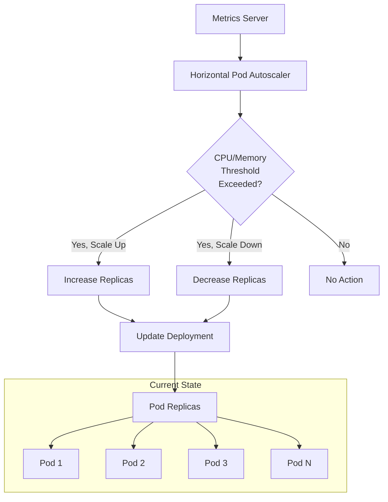
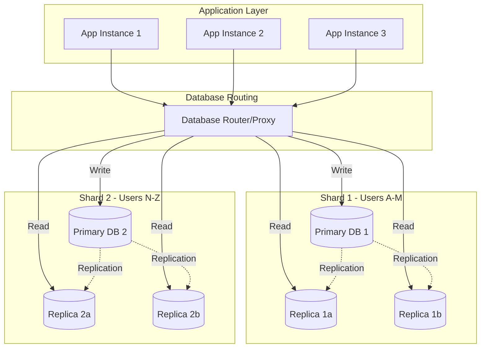
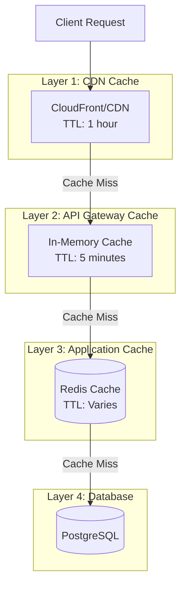
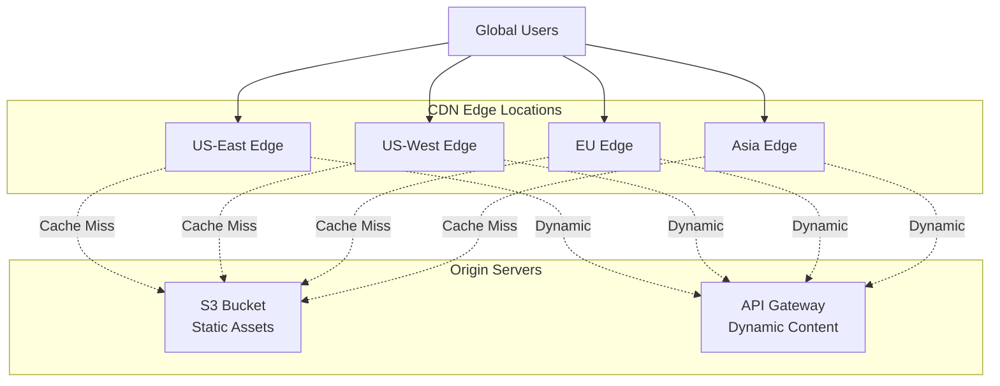
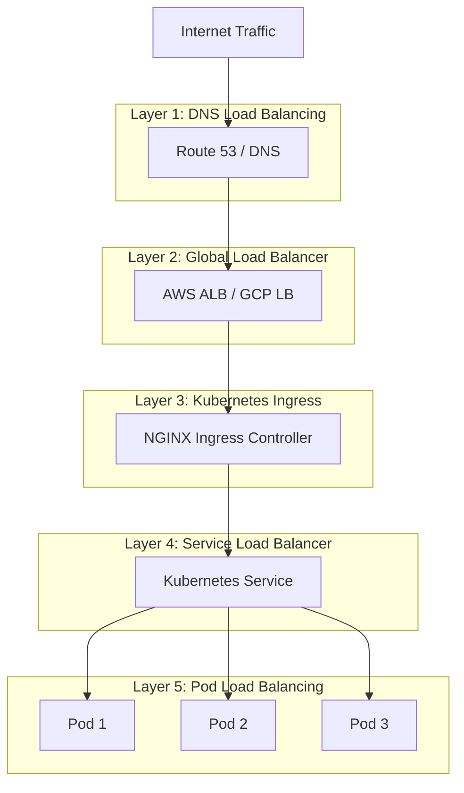
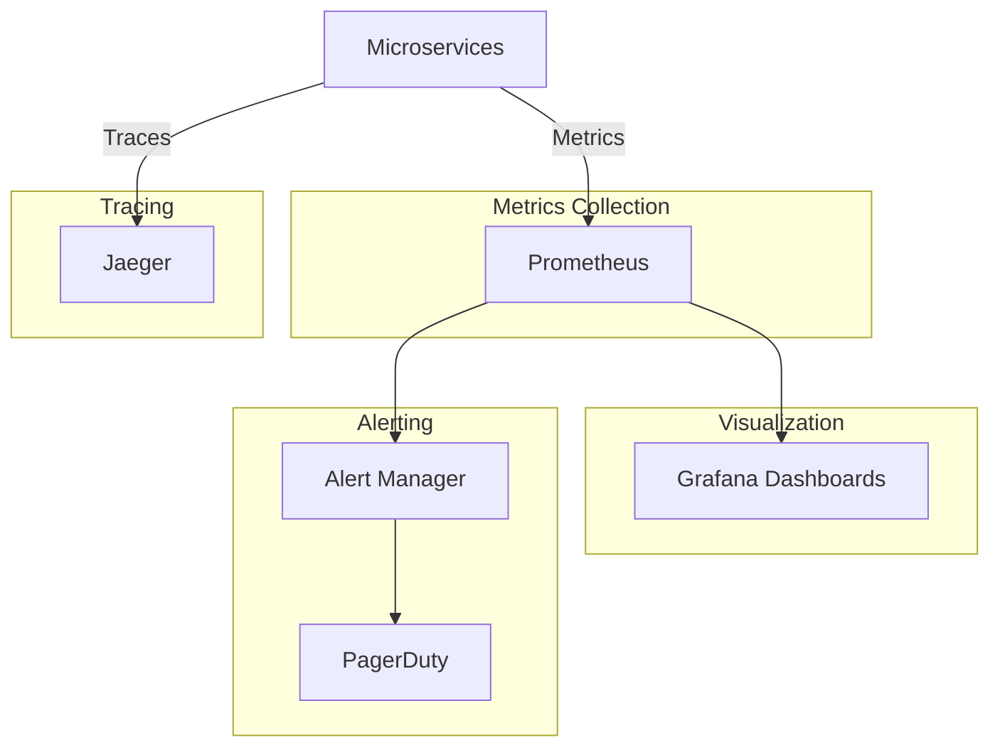

# CloudRetail Scalability and Performance

## Table of Contents
- [Overview](#overview)
- [Horizontal Scaling with Kubernetes HPA](#horizontal-scaling-with-kubernetes-hpa)
- [Database Sharding and Replication](#database-sharding-and-replication)
- [Caching Strategies](#caching-strategies)
- [CDN Usage](#cdn-usage)
- [Load Balancing](#load-balancing)
- [Auto-Scaling Policies](#auto-scaling-policies)
- [Performance Optimization](#performance-optimization)
- [Capacity Planning](#capacity-planning)
- [Performance Metrics and Monitoring](#performance-metrics-and-monitoring)

---

## Overview

CloudRetail is designed to scale horizontally to handle millions of users and transactions. The platform leverages Kubernetes autoscaling, database optimization, caching, and CDN to deliver high performance at scale.

### Scalability Goals

- **Throughput**: Handle 100,000+ requests per second
- **Latency**: P95 latency < 100ms, P99 < 200ms
- **Availability**: 99.99% uptime (52 minutes downtime/year)
- **Concurrent Users**: Support 1 million+ concurrent users
- **Data Volume**: Handle petabytes of data
- **Global Reach**: Low latency worldwide

### Scalability Principles

1. **Stateless Services**: Enable horizontal scaling
2. **Database per Service**: Independent scaling
3. **Asynchronous Processing**: Event-driven for non-blocking operations
4. **Caching**: Reduce database load
5. **CDN**: Offload static content
6. **Auto-Scaling**: Dynamic resource allocation

---

## Horizontal Scaling with Kubernetes HPA

### Horizontal Pod Autoscaler (HPA)

Kubernetes HPA automatically scales the number of pod replicas based on observed metrics.



### HPA Configuration by Service

#### API Gateway
```yaml
apiVersion: autoscaling/v2
kind: HorizontalPodAutoscaler
metadata:
  name: api-gateway-hpa
  namespace: cloudretail
spec:
  scaleTargetRef:
    apiVersion: apps/v1
    kind: Deployment
    name: api-gateway
  minReplicas: 3
  maxReplicas: 20
  metrics:
  - type: Resource
    resource:
      name: cpu
      target:
        type: Utilization
        averageUtilization: 70
  - type: Resource
    resource:
      name: memory
      target:
        type: Utilization
        averageUtilization: 80
  behavior:
    scaleUp:
      stabilizationWindowSeconds: 0
      policies:
      - type: Percent
        value: 100              # Double pods
        periodSeconds: 30
      - type: Pods
        value: 4                # Add 4 pods
        periodSeconds: 30
      selectPolicy: Max         # Use most aggressive
    scaleDown:
      stabilizationWindowSeconds: 300
      policies:
      - type: Percent
        value: 50               # Remove 50% of pods
        periodSeconds: 60
      - type: Pods
        value: 2                # Remove 2 pods
        periodSeconds: 60
      selectPolicy: Min         # Use most conservative
```

### Scaling Policies Summary

| Service | Min | Max | CPU Target | Memory Target | Scale Up | Scale Down |
|---------|-----|-----|------------|---------------|----------|------------|
| API Gateway | 3 | 20 | 70% | 80% | +100% or +4 pods | -50% or -2 pods |
| User Service | 3 | 10 | 70% | 80% | +100% or +2 pods | -50% or -1 pod |
| Product Service | 3 | 10 | 70% | 80% | +100% or +2 pods | -50% or -1 pod |
| Order Service | 3 | 15 | 70% | 80% | +100% or +3 pods | -50% or -1 pod |
| Inventory Service | 3 | 10 | 70% | 80% | +100% or +2 pods | -50% or -1 pod |
| Payment Service | 3 | 15 | 70% | 80% | +100% or +3 pods | -50% or -1 pod |
| Event Bus | 3 | 10 | 70% | 80% | +100% or +2 pods | -50% or -1 pod |

### Custom Metrics Autoscaling

Beyond CPU/Memory, scale based on custom metrics:

```yaml
metrics:
- type: Pods
  pods:
    metric:
      name: http_requests_per_second
    target:
      type: AverageValue
      averageValue: "1000"      # Scale when > 1000 req/s per pod

- type: External
  external:
    metric:
      name: kafka_consumer_lag
    target:
      type: Value
      value: "1000"             # Scale when consumer lag > 1000
```

### Vertical Pod Autoscaler (VPA)

For right-sizing pod resources:

```yaml
apiVersion: autoscaling.k8s.io/v1
kind: VerticalPodAutoscaler
metadata:
  name: user-service-vpa
spec:
  targetRef:
    apiVersion: apps/v1
    kind: Deployment
    name: user-service
  updatePolicy:
    updateMode: "Auto"
  resourcePolicy:
    containerPolicies:
    - containerName: user-service
      minAllowed:
        cpu: 100m
        memory: 256Mi
      maxAllowed:
        cpu: 2000m
        memory: 2Gi
```

---

## Database Sharding and Replication

### Database Architecture



### Sharding Strategy

#### Hash-Based Sharding
```typescript
// Shard by User ID
function getUserShard(userId: string): number {
  const hash = hashFunction(userId);
  return hash % TOTAL_SHARDS;
}

// Configuration
const TOTAL_SHARDS = 4;
const shardConfig = [
  { id: 0, host: 'db-shard-0.cloudretail.internal', port: 5432 },
  { id: 1, host: 'db-shard-1.cloudretail.internal', port: 5432 },
  { id: 2, host: 'db-shard-2.cloudretail.internal', port: 5432 },
  { id: 3, host: 'db-shard-3.cloudretail.internal', port: 5432 }
];
```

#### Range-Based Sharding
```typescript
// Shard by Date (for time-series data like orders)
function getOrderShard(orderDate: Date): number {
  const year = orderDate.getFullYear();
  const quarter = Math.floor(orderDate.getMonth() / 3);
  return (year - 2020) * 4 + quarter;
}
```

### Replication Strategy

#### Primary-Replica (Master-Slave)
- **Primary**: Handles all writes
- **Replicas**: Handle read traffic
- **Replication**: Streaming replication (PostgreSQL)
- **Read Distribution**: Round-robin across replicas

```typescript
// Database Connection Pool
import { Pool } from 'pg';

const primaryPool = new Pool({
  host: process.env.DB_PRIMARY_HOST,
  port: 5432,
  database: process.env.DB_NAME,
  max: 20,                    // Max connections
  idleTimeoutMillis: 30000
});

const replicaPools = [
  new Pool({ host: 'db-replica-1', port: 5432, max: 20 }),
  new Pool({ host: 'db-replica-2', port: 5432, max: 20 }),
  new Pool({ host: 'db-replica-3', port: 5432, max: 20 })
];

// Read from replica, write to primary
async function executeQuery(query: string, write: boolean = false) {
  if (write) {
    return primaryPool.query(query);
  } else {
    const replica = replicaPools[Math.floor(Math.random() * replicaPools.length)];
    return replica.query(query);
  }
}
```

### Connection Pooling

```typescript
// PgBouncer Configuration
[databases]
cloudretail_users = host=postgres-users port=5432 dbname=cloudretail_users

[pgbouncer]
pool_mode = transaction
max_client_conn = 1000
default_pool_size = 25
reserve_pool_size = 5
reserve_pool_timeout = 5
```

### Database Optimization

#### Indexing Strategy
```sql
-- Primary Indexes
CREATE INDEX idx_users_email ON users(email);
CREATE INDEX idx_orders_user_id ON orders(user_id);
CREATE INDEX idx_orders_created_at ON orders(created_at);

-- Composite Indexes
CREATE INDEX idx_orders_user_status ON orders(user_id, status);
CREATE INDEX idx_products_category_active ON products(category, is_active);

-- Partial Indexes
CREATE INDEX idx_active_products ON products(id) WHERE is_active = true;

-- Full-Text Search
CREATE INDEX idx_products_search ON products USING GIN(to_tsvector('english', name || ' ' || description));
```

#### Query Optimization
```sql
-- Use EXPLAIN ANALYZE
EXPLAIN ANALYZE
SELECT * FROM orders WHERE user_id = '123' AND status = 'pending';

-- Pagination with cursor
SELECT * FROM products
WHERE id > '00000000-0000-0000-0000-000000000000'
ORDER BY id
LIMIT 100;

-- Avoid SELECT *
SELECT id, name, price FROM products WHERE category = 'electronics';
```

---

## Caching Strategies

### Multi-Layer Caching



### Redis Caching

#### Cache-Aside Pattern
```typescript
import { createClient } from 'redis';

const redis = createClient({
  url: process.env.REDIS_URL,
  socket: {
    reconnectStrategy: (retries) => Math.min(retries * 50, 1000)
  }
});

// Cache-Aside Implementation
async function getProduct(productId: string): Promise<Product> {
  const cacheKey = `product:${productId}`;

  // 1. Try cache first
  const cached = await redis.get(cacheKey);
  if (cached) {
    return JSON.parse(cached);
  }

  // 2. Cache miss - fetch from database
  const product = await Product.findByPk(productId);

  // 3. Store in cache
  await redis.setEx(
    cacheKey,
    300,                          // TTL: 5 minutes
    JSON.stringify(product)
  );

  return product;
}
```

#### Write-Through Pattern
```typescript
async function updateProduct(productId: string, data: ProductData): Promise<Product> {
  // 1. Update database
  const product = await Product.update(data, {
    where: { id: productId }
  });

  // 2. Update cache
  const cacheKey = `product:${productId}`;
  await redis.setEx(
    cacheKey,
    300,
    JSON.stringify(product)
  );

  // 3. Invalidate related caches
  await redis.del(`products:category:${product.category}`);

  return product;
}
```

#### Cache Invalidation
```typescript
// Time-based expiration
await redis.setEx('key', 300, 'value');         // Expire in 5 minutes

// Event-based invalidation
eventBus.on('product.updated', async (event) => {
  const { productId, category } = event.data;
  await redis.del(`product:${productId}`);
  await redis.del(`products:category:${category}`);
  await redis.del('products:all');
});

// Cache warming (proactive caching)
async function warmCache() {
  const popularProducts = await Product.findAll({
    where: { category: 'electronics' },
    limit: 100
  });

  for (const product of popularProducts) {
    await redis.setEx(
      `product:${product.id}`,
      3600,
      JSON.stringify(product)
    );
  }
}
```

### Cache Key Patterns

```typescript
// Product cache keys
product:{id}                          // Single product
products:category:{category}          // Products by category
products:search:{query}               // Search results

// User cache keys
user:{id}                            // User profile
user:{id}:orders                     // User's orders
user:session:{sessionId}             // User session

// Inventory cache keys
inventory:{productId}                // Stock level
inventory:low_stock                  // Low stock products

// Rate limiting keys
rate_limit:{ip}:{endpoint}           // Rate limit counter
```

### Caching Strategy by Data Type

| Data Type | Cache Location | TTL | Invalidation |
|-----------|---------------|-----|--------------|
| Product Catalog | Redis + CDN | 1 hour | Event-based |
| User Session | Redis | 24 hours | Logout |
| Shopping Cart | Redis | 7 days | Checkout/Clear |
| Product Search | Redis | 5 minutes | Time-based |
| Inventory Levels | Redis | 30 seconds | Event-based |
| Static Assets | CDN | 1 year | Version-based |
| API Responses | Redis | 1-5 minutes | Event-based |

---

## CDN Usage

### CDN Architecture



### CDN Configuration

#### Static Assets
```typescript
// S3 + CloudFront Configuration
const staticAssets = {
  images: {
    bucket: 'cloudretail-images',
    cdnDomain: 'images.cloudretail.com',
    cacheControl: 'public, max-age=31536000, immutable'  // 1 year
  },
  css: {
    bucket: 'cloudretail-static',
    cdnDomain: 'static.cloudretail.com',
    cacheControl: 'public, max-age=604800'               // 1 week
  },
  javascript: {
    bucket: 'cloudretail-static',
    cdnDomain: 'static.cloudretail.com',
    cacheControl: 'public, max-age=604800'               // 1 week
  }
};

// Image URL
const imageUrl = `https://images.cloudretail.com/products/${productId}-${version}.jpg`;
```

#### API Response Caching
```typescript
// Cache API responses at CDN edge
app.get('/api/products', (req, res) => {
  res.set({
    'Cache-Control': 'public, max-age=300',              // 5 minutes
    'CDN-Cache-Control': 'max-age=600',                  // 10 minutes at CDN
    'Vary': 'Accept-Encoding'
  });

  res.json(products);
});

// Bypass cache for authenticated requests
app.get('/api/orders', authenticate, (req, res) => {
  res.set({
    'Cache-Control': 'private, no-cache, no-store, must-revalidate'
  });

  res.json(orders);
});
```

### Image Optimization

```typescript
// Image transformations at CDN edge
// https://images.cloudretail.com/products/123.jpg?w=800&h=600&q=80&f=webp

const imageTransformations = {
  thumbnail: 'w=150&h=150&q=80&f=webp',
  preview: 'w=400&h=400&q=85&f=webp',
  fullsize: 'w=1200&h=1200&q=90&f=webp'
};
```

### CDN Cache Invalidation

```typescript
// Invalidate CDN cache on content update
import { CloudFront } from 'aws-sdk';

const cloudfront = new CloudFront();

async function invalidateCDN(paths: string[]) {
  await cloudfront.createInvalidation({
    DistributionId: process.env.CLOUDFRONT_DISTRIBUTION_ID,
    InvalidationBatch: {
      CallerReference: Date.now().toString(),
      Paths: {
        Quantity: paths.length,
        Items: paths
      }
    }
  }).promise();
}

// Invalidate on product image update
await invalidateCDN([`/products/${productId}-*.jpg`]);
```

---

## Load Balancing

### Load Balancing Layers



### Load Balancing Algorithms

#### Round Robin
```yaml
apiVersion: v1
kind: Service
metadata:
  name: api-gateway
spec:
  type: ClusterIP
  sessionAffinity: None        # Round robin
  selector:
    app: api-gateway
  ports:
  - port: 8080
    targetPort: 8080
```

#### Least Connections
```nginx
upstream api_gateway {
    least_conn;
    server api-gateway-1:8080;
    server api-gateway-2:8080;
    server api-gateway-3:8080;
}
```

#### IP Hash (Session Affinity)
```yaml
apiVersion: v1
kind: Service
metadata:
  name: api-gateway
spec:
  type: ClusterIP
  sessionAffinity: ClientIP
  sessionAffinityConfig:
    clientIP:
      timeoutSeconds: 10800    # 3 hours
```

### Health Check Configuration

```yaml
livenessProbe:
  httpGet:
    path: /health/live
    port: 8080
  initialDelaySeconds: 30
  periodSeconds: 10
  timeoutSeconds: 5
  successThreshold: 1
  failureThreshold: 3

readinessProbe:
  httpGet:
    path: /health/ready
    port: 8080
  initialDelaySeconds: 10
  periodSeconds: 5
  timeoutSeconds: 3
  successThreshold: 1
  failureThreshold: 3
```

---

## Auto-Scaling Policies

### Cluster Autoscaler

Scales Kubernetes cluster nodes based on pod resource requests:

```yaml
apiVersion: v1
kind: ConfigMap
metadata:
  name: cluster-autoscaler
data:
  min-nodes: "3"
  max-nodes: "50"
  scale-down-delay-after-add: "10m"
  scale-down-unneeded-time: "10m"
```

### Predictive Scaling

Use historical data to predict traffic patterns:

```typescript
// Scheduled Scaling for Black Friday
const blackFridayScaling = {
  startDate: '2026-11-27T00:00:00Z',
  endDate: '2026-11-30T23:59:59Z',
  scaling: {
    'api-gateway': { min: 20, max: 100 },
    'order-service': { min: 15, max: 80 },
    'payment-service': { min: 15, max: 80 },
    'product-service': { min: 10, max: 50 }
  }
};
```

### Scaling Best Practices

1. **Set Appropriate Resource Requests/Limits**
```yaml
resources:
  requests:
    cpu: 500m
    memory: 512Mi
  limits:
    cpu: 1000m
    memory: 1Gi
```

2. **Configure Pod Disruption Budgets**
```yaml
apiVersion: policy/v1
kind: PodDisruptionBudget
metadata:
  name: api-gateway-pdb
spec:
  minAvailable: 2
  selector:
    matchLabels:
      app: api-gateway
```

3. **Use Metrics Server**
```bash
kubectl apply -f https://github.com/kubernetes-sigs/metrics-server/releases/latest/download/components.yaml
```

---

## Performance Optimization

### Code-Level Optimizations

#### 1. Database Query Optimization
```typescript
// Bad: N+1 Query Problem
const orders = await Order.findAll();
for (const order of orders) {
  const user = await User.findByPk(order.userId);  // N queries
}

// Good: Eager Loading
const orders = await Order.findAll({
  include: [{ model: User }]                        // 1 query
});
```

#### 2. Pagination
```typescript
// Cursor-based pagination (better performance)
async function getProducts(cursor?: string, limit: number = 100) {
  return Product.findAll({
    where: cursor ? { id: { [Op.gt]: cursor } } : {},
    order: [['id', 'ASC']],
    limit
  });
}
```

#### 3. Asynchronous Processing
```typescript
// Offload heavy tasks to background jobs
async function createOrder(orderData: OrderData) {
  // 1. Create order quickly
  const order = await Order.create(orderData);

  // 2. Publish event for async processing
  await eventBus.publishEvent({
    type: 'order.created',
    data: order
  });

  return order;
}

// Process asynchronously
eventBus.on('order.created', async (event) => {
  await sendConfirmationEmail(event.data);
  await updateAnalytics(event.data);
  await notifyWarehouse(event.data);
});
```

### Response Time Optimization

| Optimization | Impact | Implementation |
|--------------|--------|----------------|
| **Database Indexing** | 10-100x faster queries | CREATE INDEX |
| **Redis Caching** | 100-1000x faster reads | Cache-aside pattern |
| **CDN** | 5-10x faster static content | CloudFront |
| **Connection Pooling** | 2-5x faster DB connections | PgBouncer |
| **Compression** | 70% smaller payloads | gzip/brotli |
| **Code Minification** | 50% smaller JS/CSS | Webpack |
| **Image Optimization** | 80% smaller images | WebP, lazy loading |

### Compression

```typescript
import compression from 'compression';

app.use(compression({
  level: 6,                    // Compression level (0-9)
  threshold: 1024,             // Only compress responses > 1KB
  filter: (req, res) => {
    if (req.headers['x-no-compression']) {
      return false;
    }
    return compression.filter(req, res);
  }
}));
```

---

## Capacity Planning

### Resource Estimation

```typescript
// Per-Service Resource Requirements (baseline)
const resourceRequirements = {
  'api-gateway': {
    cpu: '500m',               // 0.5 CPU cores
    memory: '512Mi',           // 512 MB RAM
    requestsPerSecond: 1000,   // Handles 1000 req/s per pod
    averageLatency: '50ms'
  },
  'order-service': {
    cpu: '500m',
    memory: '512Mi',
    requestsPerSecond: 500,
    averageLatency: '100ms'
  }
};

// Calculate required pods for target throughput
function calculateRequiredPods(targetRPS: number, service: string): number {
  const serviceConfig = resourceRequirements[service];
  const podsNeeded = Math.ceil(targetRPS / serviceConfig.requestsPerSecond);
  return podsNeeded;
}

// Example: 50,000 req/s target
const apiGatewayPods = calculateRequiredPods(50000, 'api-gateway');  // 50 pods
```

### Cost Optimization

```typescript
// Right-size pod resources based on actual usage
const actualUsage = {
  'api-gateway': { cpu: '300m', memory: '384Mi' },  // Actual avg usage
  'order-service': { cpu: '350m', memory: '400Mi' }
};

// Adjust resource requests to match actual usage + 20% buffer
const optimizedRequests = {
  'api-gateway': { cpu: '360m', memory: '460Mi' },
  'order-service': { cpu: '420m', memory: '480Mi' }
};
```

---

## Performance Metrics and Monitoring

### Key Performance Indicators (KPIs)

| Metric | Target | Alert Threshold |
|--------|--------|-----------------|
| Response Time (P95) | < 100ms | > 200ms |
| Response Time (P99) | < 200ms | > 500ms |
| Error Rate | < 0.1% | > 1% |
| Throughput | > 10,000 req/s | < 5,000 req/s |
| CPU Utilization | 50-70% | > 85% |
| Memory Utilization | 60-80% | > 90% |
| Database Connection Pool | 50-80% | > 95% |
| Cache Hit Ratio | > 80% | < 60% |

### Performance Monitoring Stack



### Load Testing

```javascript
// Artillery Load Test Configuration
config:
  target: 'https://api.cloudretail.com'
  phases:
    - duration: 60
      arrivalRate: 100           # 100 users/sec for 1 minute
    - duration: 120
      arrivalRate: 500           # 500 users/sec for 2 minutes
    - duration: 60
      arrivalRate: 1000          # 1000 users/sec for 1 minute
scenarios:
  - name: 'Browse Products'
    flow:
      - get:
          url: '/api/products'
      - think: 2
      - get:
          url: '/api/products/{{ $randomString() }}'
```

---

## Summary

CloudRetail's scalability architecture provides:

- **Horizontal Scaling**: Kubernetes HPA for automatic pod scaling
- **Database Scaling**: Sharding, replication, and connection pooling
- **Caching**: Multi-layer caching with Redis and CDN
- **Load Balancing**: Multi-layer load distribution
- **Performance**: Optimized queries, async processing, compression
- **Monitoring**: Comprehensive metrics and alerting

The platform is designed to scale from thousands to millions of users with minimal manual intervention.
