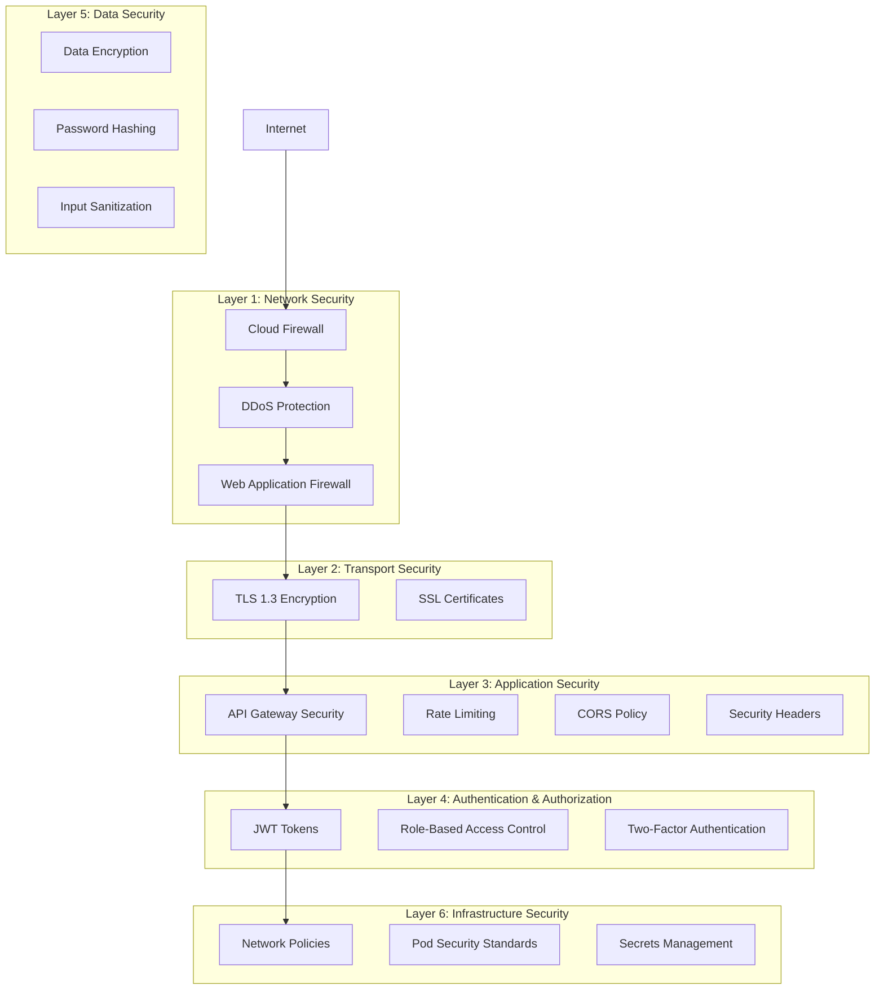
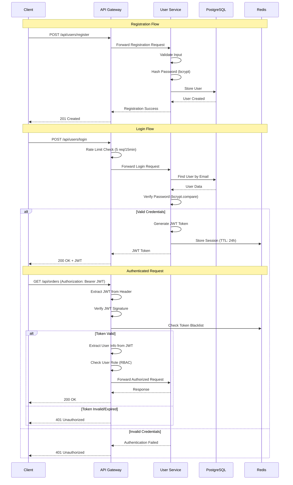
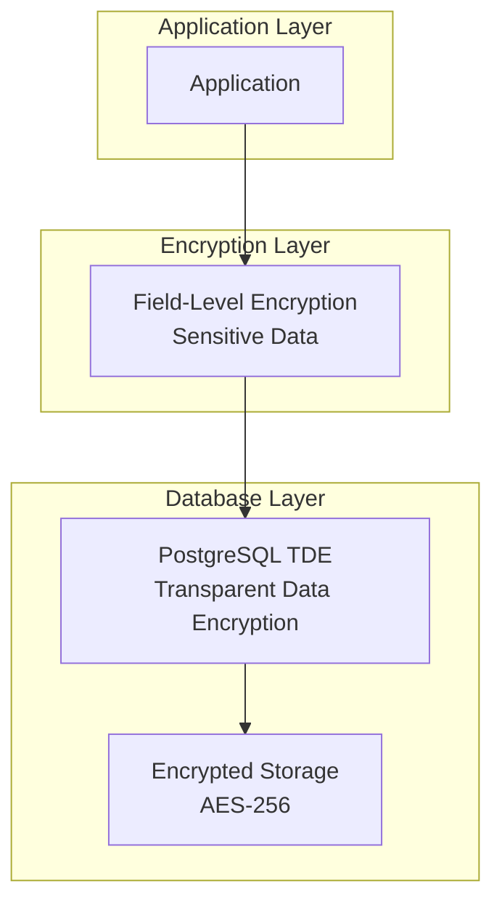
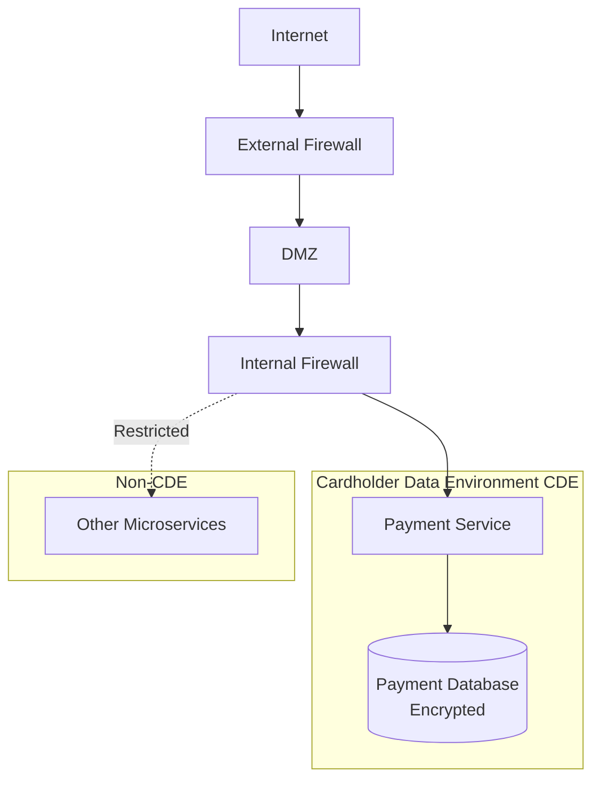
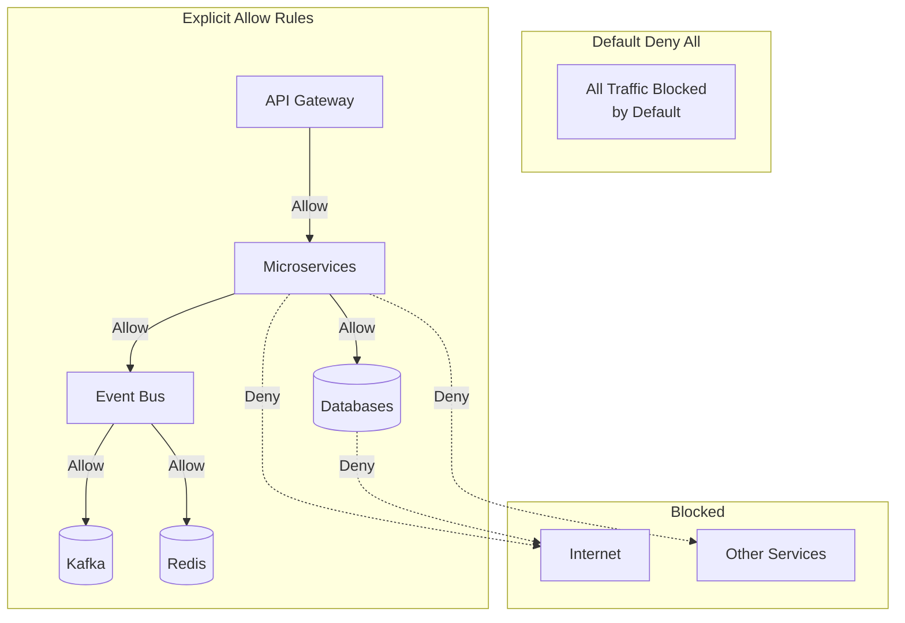
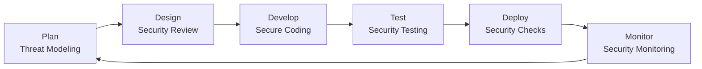

# CloudRetail Security Architecture

## Table of Contents
- [Overview](#overview)
- [Security Layers](#security-layers)
- [Authentication and Authorization](#authentication-and-authorization)
- [API Security](#api-security)
- [Data Encryption](#data-encryption)
- [GDPR Compliance](#gdpr-compliance)
- [PCI DSS Compliance](#pci-dss-compliance)
- [Network Security](#network-security)
- [Secrets Management](#secrets-management)
- [Security Best Practices](#security-best-practices)
- [Security Monitoring and Incident Response](#security-monitoring-and-incident-response)

---

## Overview

CloudRetail implements a defense-in-depth security strategy with multiple layers of protection. The platform adheres to industry standards including GDPR, PCI DSS, and OWASP Top 10 security guidelines.

### Security Principles

1. **Zero Trust Architecture**: Never trust, always verify
2. **Least Privilege**: Minimal access rights for users and services
3. **Defense in Depth**: Multiple layers of security controls
4. **Encryption Everywhere**: Data encrypted at rest and in transit
5. **Audit Everything**: Comprehensive logging and monitoring
6. **Fail Securely**: Secure defaults and graceful degradation

---

## Security Layers



---

## Authentication and Authorization

### Authentication Flow



### JWT Token Structure

```typescript
interface JwtPayload {
  userId: string;           // User UUID
  email: string;            // User email
  role: 'customer' | 'admin' | 'vendor';
  iat: number;             // Issued at timestamp
  exp: number;             // Expiration timestamp
}
```

### JWT Configuration

```typescript
// Token Generation
const JWT_SECRET = process.env.JWT_SECRET; // 256-bit secret
const JWT_EXPIRY = '24h';                  // 24 hours
const JWT_ALGORITHM = 'HS256';             // HMAC SHA-256

// Token Example
eyJhbGciOiJIUzI1NiIsInR5cCI6IkpXVCJ9.
eyJ1c2VySWQiOiIxMjM0NTY3OC05MGFiLWNkZWYtMTIzNC01Njc4OTBhYmNkZWYiLCJlbWFpbCI6InVzZXJAZXhhbXBsZS5jb20iLCJyb2xlIjoiY3VzdG9tZXIiLCJpYXQiOjE3MDY3ODQwMDAsImV4cCI6MTcwNjg3MDQwMH0.
signature
```

### Role-Based Access Control (RBAC)

| Role | Permissions |
|------|-------------|
| **Customer** | - View products<br/>- Create orders<br/>- View own orders<br/>- Update own profile |
| **Vendor** | - All customer permissions<br/>- Create/update products<br/>- Manage inventory<br/>- View vendor orders |
| **Admin** | - All vendor permissions<br/>- Manage users<br/>- View all orders<br/>- Access admin panel<br/>- System configuration |

### Authorization Middleware

```typescript
// Protect routes with authentication
app.get('/api/orders', authenticate, getOrders);

// Protect routes with role-based authorization
app.post('/api/products', authenticate, authorize('admin', 'vendor'), createProduct);
app.delete('/api/users/:id', authenticate, authorize('admin'), deleteUser);
```

### Two-Factor Authentication (2FA)

- **Protocol**: TOTP (Time-based One-Time Password)
- **Algorithm**: HMAC-SHA1
- **Implementation**: Google Authenticator compatible
- **Backup Codes**: 10 single-use recovery codes

```typescript
interface TwoFactorAuth {
  enabled: boolean;
  secret: string;              // Base32 encoded secret
  backupCodes: string[];       // Hashed backup codes
  lastVerified: Date;
}
```

---

## API Security

### Rate Limiting

Prevents abuse and DDoS attacks using sliding window algorithm:

```typescript
// Standard Rate Limiter
const standardRateLimiter = rateLimit({
  windowMs: 15 * 60 * 1000,    // 15 minutes
  max: 100,                     // 100 requests per window
  message: 'Too many requests, please try again later'
});

// Strict Rate Limiter (Login, Payment)
const strictRateLimiter = rateLimit({
  windowMs: 15 * 60 * 1000,    // 15 minutes
  max: 5,                       // 5 requests per window
  message: 'Too many attempts, please try again later'
});
```

### Rate Limit Tiers

| Endpoint Type | Requests/15min | Requests/hour | Requests/day |
|--------------|----------------|---------------|--------------|
| Public (Products) | 200 | 800 | 10,000 |
| Authenticated | 100 | 400 | 5,000 |
| Login/Register | 5 | 20 | 100 |
| Payment | 5 | 20 | 100 |
| Admin | 500 | 2,000 | 20,000 |

### CORS (Cross-Origin Resource Sharing)

```typescript
const corsOptions = {
  origin: process.env.ALLOWED_ORIGINS?.split(',') || ['https://cloudretail.com'],
  methods: ['GET', 'POST', 'PUT', 'DELETE', 'PATCH'],
  allowedHeaders: ['Content-Type', 'Authorization', 'X-Correlation-ID'],
  exposedHeaders: ['X-Correlation-ID'],
  credentials: true,
  maxAge: 86400              // 24 hours preflight cache
};
```

### Security Headers (Helmet)

```typescript
helmet({
  // Content Security Policy
  contentSecurityPolicy: {
    directives: {
      defaultSrc: ["'self'"],
      styleSrc: ["'self'", "'unsafe-inline'"],
      scriptSrc: ["'self'"],
      imgSrc: ["'self'", 'data:', 'https:'],
      connectSrc: ["'self'"],
      fontSrc: ["'self'"],
      objectSrc: ["'none'"],
      mediaSrc: ["'self'"],
      frameSrc: ["'none'"]
    }
  },
  // HTTP Strict Transport Security
  hsts: {
    maxAge: 31536000,        // 1 year
    includeSubDomains: true,
    preload: true
  },
  // X-Frame-Options
  frameguard: {
    action: 'deny'
  },
  // X-Content-Type-Options
  noSniff: true,
  // X-XSS-Protection
  xssFilter: true,
  // Referrer-Policy
  referrerPolicy: {
    policy: 'strict-origin-when-cross-origin'
  }
});
```

### API Key Authentication

For external integrations and third-party services:

```typescript
// API Key Validation
app.use('/api/webhooks', validateApiKey);

// Header Format
X-API-Key: cloudretail_live_sk_1234567890abcdef

// API Key Structure
{
  prefix: 'cloudretail_live_sk_',  // or cloudretail_test_sk_
  key: 'random_64_characters',
  permissions: ['read:products', 'write:orders'],
  rateLimit: 1000,                  // requests per hour
  expiresAt: Date
}
```

### Input Validation and Sanitization

```typescript
// SQL Injection Prevention
- Use parameterized queries (Sequelize ORM)
- Input validation with Joi/Zod schemas
- Escape special characters

// XSS Prevention
- Sanitize HTML input
- Content Security Policy headers
- Escape output in templates

// Command Injection Prevention
- Avoid shell commands with user input
- Whitelist allowed characters
- Use safe APIs instead of exec()
```

---

## Data Encryption

### Encryption at Rest



#### PostgreSQL Encryption
- **Algorithm**: AES-256-GCM
- **Key Management**: AWS KMS, GCP KMS, or HashiCorp Vault
- **Scope**: Database files, WAL files, backups

#### Field-Level Encryption
Sensitive fields encrypted before database storage:

```typescript
// Encrypted Fields
- Credit card numbers (PCI DSS requirement)
- Social security numbers
- Personal identification numbers
- Bank account details

// Encryption Library
import { encrypt, decrypt } from 'crypto';

const ENCRYPTION_KEY = process.env.ENCRYPTION_KEY; // 256-bit key
const ALGORITHM = 'aes-256-gcm';

function encryptField(plaintext: string): EncryptedData {
  const iv = crypto.randomBytes(16);
  const cipher = crypto.createCipheriv(ALGORITHM, ENCRYPTION_KEY, iv);
  const encrypted = Buffer.concat([cipher.update(plaintext, 'utf8'), cipher.final()]);
  const authTag = cipher.getAuthTag();

  return {
    encrypted: encrypted.toString('base64'),
    iv: iv.toString('base64'),
    authTag: authTag.toString('base64')
  };
}
```

### Encryption in Transit

#### TLS/SSL Configuration
- **Protocol**: TLS 1.3 (minimum TLS 1.2)
- **Cipher Suites**: Strong ciphers only (ECDHE, AES-GCM)
- **Certificate**: Let's Encrypt or commercial CA
- **HSTS**: Enabled with 1-year max-age

```nginx
# NGINX SSL Configuration
ssl_protocols TLSv1.2 TLSv1.3;
ssl_ciphers 'ECDHE-ECDSA-AES128-GCM-SHA256:ECDHE-RSA-AES128-GCM-SHA256';
ssl_prefer_server_ciphers on;
ssl_session_cache shared:SSL:10m;
ssl_session_timeout 10m;
ssl_stapling on;
ssl_stapling_verify on;
```

#### Internal Service Communication
- **Protocol**: TLS 1.3 with mutual TLS (mTLS)
- **Certificates**: Service mesh certificates
- **Certificate Rotation**: Automatic every 24 hours

### Password Security

```typescript
// Password Hashing
import bcrypt from 'bcrypt';

const SALT_ROUNDS = 12;  // High work factor

// Hash password
async function hashPassword(password: string): Promise<string> {
  return bcrypt.hash(password, SALT_ROUNDS);
}

// Verify password
async function verifyPassword(password: string, hash: string): Promise<boolean> {
  return bcrypt.compare(password, hash);
}

// Password Requirements
{
  minLength: 12,
  requireUppercase: true,
  requireLowercase: true,
  requireNumbers: true,
  requireSpecialChars: true,
  preventCommonPasswords: true,
  preventUserInfo: true
}
```

---

## GDPR Compliance

### Data Protection Principles

1. **Lawfulness, Fairness, and Transparency**
2. **Purpose Limitation**
3. **Data Minimization**
4. **Accuracy**
5. **Storage Limitation**
6. **Integrity and Confidentiality**
7. **Accountability**

### GDPR Implementation

```typescript
interface GDPRCompliance {
  // Consent Management
  consent: {
    marketing: boolean;
    analytics: boolean;
    thirdParty: boolean;
    timestamp: Date;
    version: string;
  };

  // Data Subject Rights
  rights: {
    accessRequest: () => Promise<UserData>;      // Right to Access
    rectification: () => Promise<void>;          // Right to Rectification
    erasure: () => Promise<void>;                // Right to Erasure (Right to be Forgotten)
    dataPortability: () => Promise<ExportData>;  // Right to Data Portability
    restrictProcessing: () => Promise<void>;     // Right to Restrict Processing
    object: () => Promise<void>;                 // Right to Object
  };
}
```

### Data Retention Policies

| Data Type | Retention Period | Justification |
|-----------|-----------------|---------------|
| User Accounts | Until deletion request | Legitimate interest |
| Order History | 7 years | Tax/legal requirements |
| Payment Logs | 7 years | PCI DSS compliance |
| Marketing Emails | Until consent withdrawn | Consent-based |
| Analytics Data | 26 months | Google Analytics default |
| Server Logs | 90 days | Security monitoring |
| Audit Logs | 7 years | Compliance |

### Privacy by Design

```typescript
// Data Minimization
- Collect only necessary fields
- Anonymous analytics where possible
- Pseudonymization of personal data

// Consent Management
app.post('/api/users/register', async (req, res) => {
  const { gdprConsent } = req.body;

  if (!gdprConsent) {
    return res.status(400).json({
      error: 'GDPR consent required'
    });
  }

  // Store consent with timestamp
  await User.create({
    ...userData,
    gdprConsent: true,
    consentTimestamp: new Date(),
    consentVersion: '1.0'
  });
});

// Data Export (Data Portability)
app.get('/api/users/export', authenticate, async (req, res) => {
  const userData = await getUserData(req.user.userId);
  res.json({
    format: 'JSON',
    data: userData,
    exportedAt: new Date()
  });
});

// Right to Erasure
app.delete('/api/users/me', authenticate, async (req, res) => {
  await anonymizeUserData(req.user.userId);
  await deleteUserAccount(req.user.userId);
  res.status(204).send();
});
```

### GDPR Headers

```typescript
// Add GDPR-related headers to responses
res.setHeader('X-Data-Processing-Region', 'EU');
res.setHeader('X-Privacy-Policy', 'https://cloudretail.com/privacy');
res.setHeader('X-Data-Controller', 'CloudRetail Ltd.');
```

---

## PCI DSS Compliance

### PCI DSS Requirements

CloudRetail adheres to PCI DSS (Payment Card Industry Data Security Standard) for handling payment card data.

#### Requirement 1-2: Secure Network



#### Requirement 3-4: Protect Cardholder Data

```typescript
// NEVER store sensitive authentication data (CAV2/CVC2/CVV2)
// Store only masked PAN (Primary Account Number)

interface SecurePayment {
  // Stored Data (encrypted)
  maskedPan: string;           // e.g., "************1234"
  expiryMonth: string;         // Encrypted
  expiryYear: string;          // Encrypted
  cardholderName: string;      // Encrypted

  // Never Stored
  // cvv: string;              // PROHIBITED
  // fullPan: string;          // PROHIBITED (unless encrypted with key management)
  // pin: string;              // PROHIBITED

  // Tokenization
  token: string;               // Payment gateway token
  gateway: 'stripe' | 'paypal';
}

// Payment Processing
async function processPayment(paymentData: PaymentData): Promise<PaymentResult> {
  // 1. Tokenize card data immediately
  const token = await paymentGateway.tokenize({
    cardNumber: paymentData.cardNumber,
    cvv: paymentData.cvv,
    expiry: paymentData.expiry
  });

  // 2. Use token for payment (card data never touches our servers)
  const result = await paymentGateway.charge({
    token: token,
    amount: paymentData.amount
  });

  // 3. Store only non-sensitive data
  await Payment.create({
    transactionId: result.id,
    maskedPan: paymentData.cardNumber.slice(-4).padStart(16, '*'),
    token: token,
    amount: paymentData.amount
  });

  return result;
}
```

#### PCI DSS Security Controls

| Requirement | Implementation |
|-------------|----------------|
| **1. Firewall** | Network policies, WAF |
| **2. Default Passwords** | All defaults changed, strong passwords enforced |
| **3. Stored Data** | Encryption at rest (AES-256), field-level encryption |
| **4. Transmission** | TLS 1.3, strong ciphers |
| **5. Antivirus** | Container scanning, runtime protection |
| **6. Secure Systems** | Regular updates, vulnerability scanning |
| **7. Access Control** | RBAC, least privilege |
| **8. Unique IDs** | Individual user accounts, no shared accounts |
| **9. Physical Access** | Cloud provider controls, SOC 2 certified DCs |
| **10. Logging** | Comprehensive audit logs, 1-year retention |
| **11. Security Testing** | Quarterly ASV scans, annual penetration tests |
| **12. Security Policy** | Documented policies, regular training |

---

## Network Security

### Zero-Trust Network Policy



### Network Policies

```yaml
# Default Deny All Traffic
apiVersion: networking.k8s.io/v1
kind: NetworkPolicy
metadata:
  name: default-deny-all
  namespace: cloudretail
spec:
  podSelector: {}
  policyTypes:
  - Ingress
  - Egress

# Allow Specific Service Communication
apiVersion: networking.k8s.io/v1
kind: NetworkPolicy
metadata:
  name: allow-api-gateway-to-services
spec:
  podSelector:
    matchLabels:
      component: microservice
  ingress:
  - from:
    - podSelector:
        matchLabels:
          app: api-gateway
```

### Service Mesh (Future Enhancement)

Consider implementing Istio or Linkerd for:
- Mutual TLS (mTLS) between services
- Traffic encryption
- Service-to-service authentication
- Fine-grained authorization policies
- Traffic management

---

## Secrets Management

### Kubernetes Secrets

```yaml
apiVersion: v1
kind: Secret
metadata:
  name: cloudretail-secrets
  namespace: cloudretail
type: Opaque
data:
  JWT_SECRET: <base64-encoded-secret>
  DB_PASSWORD: <base64-encoded-password>
  ENCRYPTION_KEY: <base64-encoded-key>
  STRIPE_API_KEY: <base64-encoded-key>
```

### HashiCorp Vault Integration (Production)

```typescript
// Vault Configuration
import Vault from 'node-vault';

const vault = Vault({
  endpoint: process.env.VAULT_ADDR,
  token: process.env.VAULT_TOKEN
});

// Retrieve Secrets
async function getSecret(path: string): Promise<string> {
  const result = await vault.read(path);
  return result.data.value;
}

// Secret Paths
const secrets = {
  jwtSecret: await getSecret('secret/cloudretail/jwt-secret'),
  dbPassword: await getSecret('secret/cloudretail/db-password'),
  encryptionKey: await getSecret('secret/cloudretail/encryption-key')
};
```

### Secret Rotation

- **Database Passwords**: Rotate every 90 days
- **API Keys**: Rotate every 180 days
- **JWT Secrets**: Rotate every 365 days
- **TLS Certificates**: Auto-renew 30 days before expiry

---

## Security Best Practices

### OWASP Top 10 Mitigation

| Vulnerability | Mitigation |
|--------------|------------|
| **A01: Broken Access Control** | RBAC, JWT authentication, authorization middleware |
| **A02: Cryptographic Failures** | TLS 1.3, AES-256, bcrypt hashing, proper key management |
| **A03: Injection** | Parameterized queries, input validation, ORM usage |
| **A04: Insecure Design** | Threat modeling, secure design patterns, defense in depth |
| **A05: Security Misconfiguration** | Secure defaults, automated security scanning, hardened containers |
| **A06: Vulnerable Components** | Dependency scanning, automated updates, SCA tools |
| **A07: Authentication Failures** | Strong passwords, 2FA, rate limiting, session management |
| **A08: Software/Data Integrity** | Code signing, SRI, supply chain security |
| **A09: Logging Failures** | Comprehensive logging, SIEM integration, audit trails |
| **A10: SSRF** | Input validation, allowlist, network segmentation |

### Secure Development Lifecycle



### Security Checklist

- [ ] All secrets stored in Kubernetes Secrets or Vault
- [ ] TLS 1.3 enabled for all communications
- [ ] Input validation on all endpoints
- [ ] Rate limiting configured
- [ ] CORS properly configured
- [ ] Security headers (Helmet) enabled
- [ ] SQL injection protection (parameterized queries)
- [ ] XSS protection (CSP, output escaping)
- [ ] Authentication on protected endpoints
- [ ] Authorization (RBAC) enforced
- [ ] Password hashing with bcrypt (12+ rounds)
- [ ] JWT tokens with expiration
- [ ] Audit logging enabled
- [ ] Dependency vulnerability scanning
- [ ] Container image scanning
- [ ] Network policies configured
- [ ] GDPR compliance implemented
- [ ] PCI DSS controls in place

---

## Security Monitoring and Incident Response

### Security Monitoring

```typescript
// Security Events to Monitor
const securityEvents = [
  'failed_login_attempts',
  'rate_limit_exceeded',
  'invalid_jwt_token',
  'unauthorized_access_attempt',
  'suspicious_ip_activity',
  'privilege_escalation_attempt',
  'data_export_request',
  'account_deletion_request',
  'payment_failure_pattern'
];

// Alerting Thresholds
const alerts = {
  failedLogins: 5,           // 5 failed logins in 15 minutes
  rateLimitHits: 100,        // 100 rate limit hits in 1 hour
  invalidTokens: 20,         // 20 invalid tokens in 5 minutes
  suspiciousIPs: 1000        // 1000 requests from single IP in 10 minutes
};
```

### Incident Response Plan

1. **Detection**: Automated alerts, SIEM monitoring
2. **Containment**: Isolate affected services, revoke tokens
3. **Eradication**: Remove threat, patch vulnerabilities
4. **Recovery**: Restore services, verify integrity
5. **Post-Incident**: Root cause analysis, improve defenses

### Audit Logging

```typescript
interface AuditLog {
  timestamp: Date;
  userId?: string;
  action: string;
  resource: string;
  ipAddress: string;
  userAgent: string;
  result: 'success' | 'failure';
  metadata: Record<string, any>;
}

// Example Audit Entries
{
  timestamp: '2026-02-01T12:00:00Z',
  userId: 'user-123',
  action: 'login',
  resource: '/api/users/login',
  ipAddress: '192.168.1.100',
  result: 'success',
  metadata: { method: '2fa' }
}
```

---

## Summary

CloudRetail implements comprehensive security measures across all layers:

- **Authentication**: JWT with 2FA, strong password policies
- **Authorization**: RBAC with least privilege
- **Encryption**: TLS 1.3 in transit, AES-256 at rest
- **Compliance**: GDPR and PCI DSS adherent
- **Network**: Zero-trust with explicit allow policies
- **Monitoring**: Comprehensive audit logging and alerting
- **Incident Response**: Defined processes and playbooks

Security is continuously improved through regular audits, penetration testing, and staying current with security best practices.
